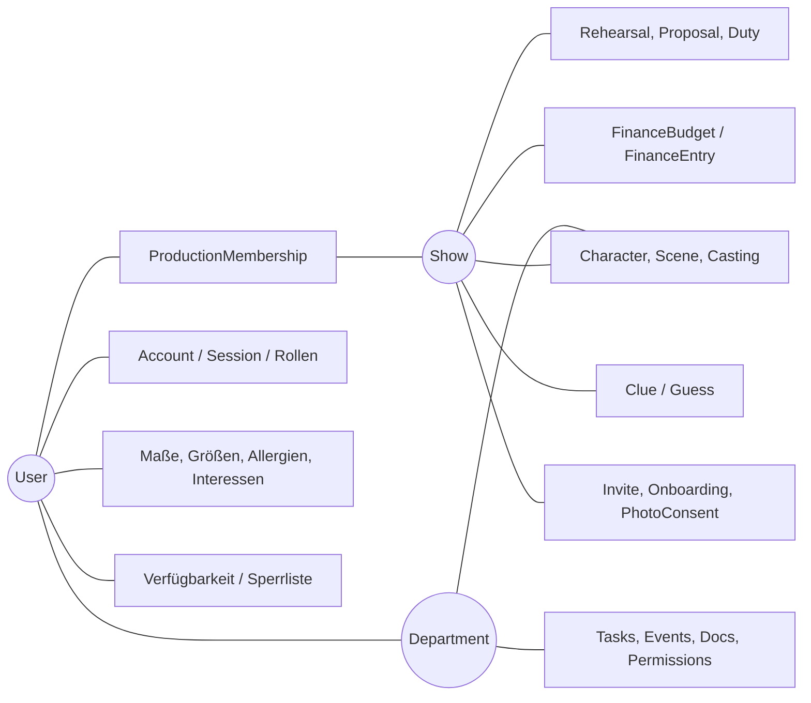
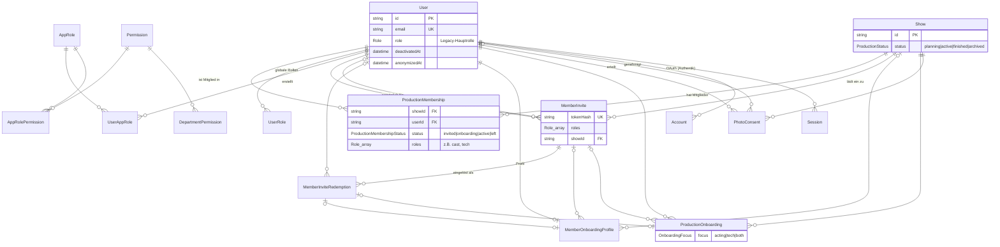
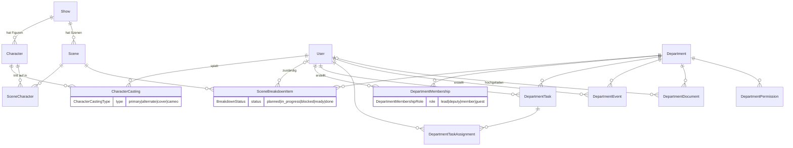
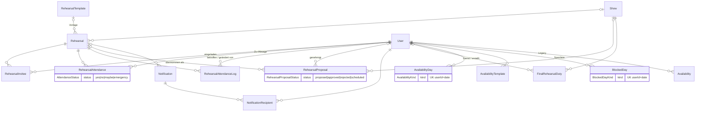
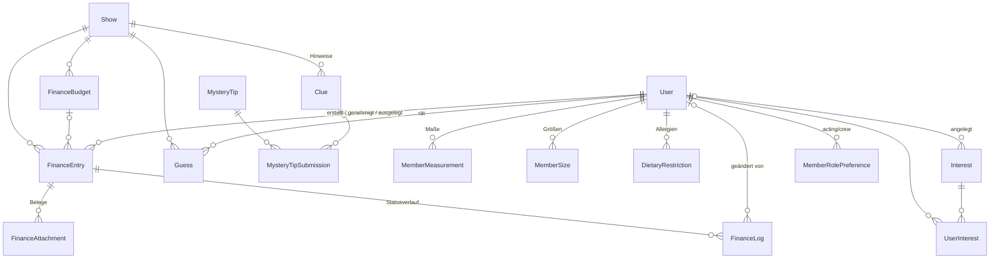
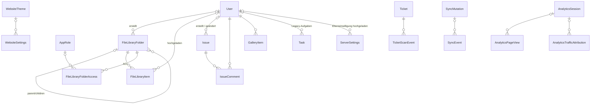

# Datenmodell Mitgliederbereich

Quelle: `prisma/schema.prisma` (PostgreSQL, Prisma). Stand: 2026-09-24, 94 Modelle, 41 Enums.
Die Feld-Referenz ab Abschnitt „Modelle im Detail“ wird aus dem Schema generiert. Bei Schemaänderungen neu erzeugen, nicht von Hand pflegen (siehe [Aktualisierung](#aktualisierung)).

> **Begriffe:** Eine _Produktion_ heißt im Code `Show`. _Gewerke_ sind `Department`.

## Inhalt

1. [Überblick](#überblick)
2. [ER-Diagramme](#er-diagramme)
3. [Rollen- und Rechtemodell](#rollen--und-rechtemodell)
4. [Besonderheiten und Legacy](#besonderheiten-und-legacy)
5. [Modelle im Detail](#modelle-im-detail)
6. [Enums](#enums)

## Überblick



- **`User`** ist die zentrale Person: Login, globale Rollen und persönliche Daten.
- **`Show`** ist die zentrale Klammer für alles, was eine Produktion betrifft.
- **`ProductionMembership`** verbindet User und Show (n:m) und trägt Status sowie produktionsbezogene Rollen.
- **`Department`** (Gewerk) ist produktionsunabhängig. Es hängt nur indirekt über `SceneBreakdownItem → Scene → Show` an einer Produktion.
- Ohne Fremdschlüssel zu User oder Show: Singleton-Einstellungen (`*Settings`, `HomepageCountdown`, `HomepageFlyer` mit festen IDs wie `"default"` bzw. `"public"`), `InventoryItem`, `Ticket`, `Announcement`, `Sync*` und die `Analytics*`-Tabellen.

## ER-Diagramme

Legende: `||--o{` 1:n, `|o--o{` optionales 1:n (FK nullable), `||--o|` 1:0..1. „UK“ = Unique-Constraint.

### Kern: User, Produktion, Mitgliedschaft, Onboarding



### Stück und Gewerke



### Proben, Anwesenheit, Verfügbarkeit



### Finanzen, Mystery-Spiel, persönliche Daten



### Dateien, Issues, Galerie, Website, Tickets, Sync



## Rollen- und Rechtemodell

Rollen gibt es auf drei Ebenen:

| Ebene           | Modell                                               | Geltungsbereich                                                                                       |
| --------------- | ---------------------------------------------------- | ----------------------------------------------------------------------------------------------------- |
| Global (Legacy) | `User.role` (`Role`)                                 | eine Hauptrolle pro User                                                                              |
| Global          | `UserRole` (`Role`, UK userId+role)                  | mehrere Systemrollen pro User                                                                         |
| Pro Produktion  | `ProductionMembership.roles` (`Role[]`)              | z. B. `cast`/`tech` nur in dieser Show                                                                |
| Feingranular    | `AppRole` → `AppRolePermission` → `Permission`       | frei definierbare Rollen mit Permission-Keys; `AppRole.systemRole` kann an eine `Role` gekoppelt sein |
| Gewerk          | `DepartmentMembership.role` + `DepartmentPermission` | Leitung/Mitglied im Gewerk; Permissions pro Gewerk                                                    |
| Dateiablage     | `FileLibraryFolderAccess`                            | VIEW/DOWNLOAD/UPLOAD pro Ordner, Ziel ist eine System-Rolle **oder** eine AppRole                     |

Mögliche Werte von `Role`: `member`, `cast`, `tech`, `board`, `finance`, `owner`, `admin`.

## Besonderheiten und Legacy

- **Onboarding gibt es doppelt:** `MemberOnboardingProfile` gibt es genau einmal pro User (`userId` unique), der Bezug zur Show ist optional. Das ist der ältere, globale Weg. `ProductionOnboarding` ist eindeutig pro (User, Show) und damit der produktionsbezogene Weg.
- **Einladungen:** Ein `MemberInvite` ist immer an eine Show gebunden und kann persönlich (`personalFor`) oder offen sein. Jede Einlösung erzeugt eine `MemberInviteRedemption`, die mit maximal einem Onboarding-Datensatz verknüpft ist.
- **Verfügbarkeit:** `Availability` ist Legacy (Zeitfenster mit Status). Neu sind `AvailabilityDay` (Einträge pro Tag) und `AvailabilityTemplate` (wiederkehrend). `BlockedDay` ist die Sperrliste.
- **Aufgaben:** `Task` sind globale Legacy-Aufgaben. `DepartmentTask` sind Aufgaben eines Gewerks mit mehreren Zuständigen.
- **Show-Bezug:** Nur optional bei `Rehearsal`, `RehearsalProposal` und `MemberOnboardingProfile`. Pflicht bei Character, Scene, Finance*, Clue, Guess, PhotoConsent, ProductionMembership, ProductionOnboarding, MemberInvite und FinalRehearsalDuty.
- **Mehrfachrelationen zu User** werden über benannte `@relation` unterschieden:
  - FinanceEntry: createdBy, approvedBy, memberPaidBy
  - Issue: createdBy, updatedBy
  - RehearsalAttendanceLog: user, changedBy
  - FinalRehearsalDuty: assignee, createdBy
  - PhotoConsent: user, approvedBy
  - MemberInvite: createdBy, personalFor
- **Löschverhalten** (`onDelete`) steht in der Referenz unten bei jedem Relationsfeld.
- **Singletons:** `*Settings`, `HomepageCountdown` und `HomepageFlyer` haben eine feste ID und damit genau eine Zeile.

## Aktualisierung

Die Abschnitte „Modelle im Detail“ und „Enums“ werden mit `scripts/gen-datamodel-doc.py` aus `prisma/schema.prisma` erzeugt:

```bash
python3 scripts/gen-datamodel-doc.py > /tmp/ref.md
# Inhalt ab "## Modelle im Detail" in docs/datenmodell.md ersetzen
```

Übersicht, Diagramme und Erläuterungen oben werden von Hand gepflegt. Neue Relationen müssen dort ergänzt werden.

# Modelle im Detail

## Identität, Auth & Rollen

### `User`

| Feld                              | Typ                            | Attribute / Beschreibung                                                                 |
| --------------------------------- | ------------------------------ | ---------------------------------------------------------------------------------------- |
| `id`                              | `String`                       | @id @default(cuid())                                                                     |
| `firstName`                       | `String?`                      |                                                                                          |
| `lastName`                        | `String?`                      |                                                                                          |
| `name`                            | `String?`                      |                                                                                          |
| `email`                           | `String?`                      | @unique                                                                                  |
| `emailVerified`                   | `DateTime?`                    |                                                                                          |
| `role`                            | `Role` (enum)                  | @default(member)                                                                         |
| `passwordHash`                    | `String?`                      |                                                                                          |
| `createdAt`                       | `DateTime`                     | @default(now())                                                                          |
| `dateOfBirth`                     | `DateTime?`                    |                                                                                          |
| `deactivatedAt`                   | `DateTime?`                    |                                                                                          |
| `anonymizedAt`                    | `DateTime?`                    | Gesetzt, wenn personenbezogene Daten nach Ablauf der Aufbewahrungsfrist entfernt wurden. |
| `sessionVersion`                  | `Int`                          | @default(0)                                                                              |
| `onboardingCompletedAt`           | `DateTime?`                    |                                                                                          |
| `onboardingUpdatedAt`             | `DateTime?`                    |                                                                                          |
| `avatarSource`                    | `AvatarSource` (enum)          | @default(GRAVATAR)                                                                       |
| `avatarImage`                     | `Bytes?`                       |                                                                                          |
| `avatarImageMime`                 | `String?`                      |                                                                                          |
| `avatarImageUpdatedAt`            | `DateTime?`                    |                                                                                          |
| `payoutMethod`                    | `PayoutMethod` (enum)          | @default(BANK_TRANSFER)                                                                  |
| `payoutAccountHolder`             | `String?`                      |                                                                                          |
| `payoutIban`                      | `String?`                      |                                                                                          |
| `payoutBankName`                  | `String?`                      |                                                                                          |
| `payoutPaypalHandle`              | `String?`                      |                                                                                          |
| `payoutNote`                      | `String?`                      |                                                                                          |
| `accounts`                        | → `Account[]`                  |                                                                                          |
| `sessions`                        | → `Session[]`                  |                                                                                          |
| `guesses`                         | → `Guess[]`                    |                                                                                          |
| `attendance`                      | → `RehearsalAttendance[]`      |                                                                                          |
| `availability`                    | → `Availability[]`             |                                                                                          |
| `tasks`                           | → `Task[]`                     | @relation("TaskAssignee")                                                                |
| `availabilityDays`                | → `AvailabilityDay[]`          | New availability relations                                                               |
| `availabilityTemplates`           | → `AvailabilityTemplate[]`     |                                                                                          |
| `attendanceLogsAuthored`          | → `RehearsalAttendanceLog[]`   | @relation("AttendanceLogAuthor")                                                         |
| `attendanceLogsTarget`            | → `RehearsalAttendanceLog[]`   | @relation("AttendanceLogTarget")                                                         |
| `dietaryRestrictions`             | → `DietaryRestriction[]`       |                                                                                          |
| `measurements`                    | → `MemberMeasurement[]`        |                                                                                          |
| `sizes`                           | → `MemberSize[]`               |                                                                                          |
| `roles`                           | → `UserRole[]`                 |                                                                                          |
| `approvedProposals`               | → `RehearsalProposal[]`        | @relation("ProposalApprover")                                                            |
| `notifications`                   | → `NotificationRecipient[]`    |                                                                                          |
| `blockedDays`                     | → `BlockedDay[]`               |                                                                                          |
| `appRoles`                        | → `UserAppRole[]`              |                                                                                          |
| `rehearsalInvites`                | → `RehearsalInvitee[]`         |                                                                                          |
| `photoConsents`                   | → `PhotoConsent[]`             |                                                                                          |
| `productionOnboardings`           | → `ProductionOnboarding[]`     |                                                                                          |
| `approvedPhotoConsents`           | → `PhotoConsent[]`             | @relation("PhotoConsentApprover")                                                        |
| `departmentMemberships`           | → `DepartmentMembership[]`     |                                                                                          |
| `departmentTaskAssignments`       | → `DepartmentTaskAssignment[]` |                                                                                          |
| `departmentTasksCreated`          | → `DepartmentTask[]`           | @relation("DepartmentTaskCreator")                                                       |
| `departmentEventsCreated`         | → `DepartmentEvent[]`          |                                                                                          |
| `departmentDocumentsUploaded`     | → `DepartmentDocument[]`       |                                                                                          |
| `characterCastings`               | → `CharacterCasting[]`         |                                                                                          |
| `breakdownAssignments`            | → `SceneBreakdownItem[]`       | @relation("BreakdownAssignee")                                                           |
| `inviteLinksCreated`              | → `MemberInvite[]`             | @relation("MemberInvitesCreated")                                                        |
| `personalInvites`                 | → `MemberInvite[]`             | @relation("MemberInvitesPersonal")                                                       |
| `inviteRedemptions`               | → `MemberInviteRedemption[]`   |                                                                                          |
| `onboardingProfile`               | → `MemberOnboardingProfile?`   |                                                                                          |
| `interests`                       | → `UserInterest[]`             |                                                                                          |
| `rolePreferences`                 | → `MemberRolePreference[]`     |                                                                                          |
| `productionMemberships`           | → `ProductionMembership[]`     |                                                                                          |
| `interestsAuthored`               | → `Interest[]`                 | @relation("InterestCreatedBy")                                                           |
| `issuesCreated`                   | → `Issue[]`                    | @relation("IssueCreatedBy")                                                              |
| `issuesUpdated`                   | → `Issue[]`                    | @relation("IssueUpdatedBy")                                                              |
| `issueComments`                   | → `IssueComment[]`             | @relation("IssueCommentAuthor")                                                          |
| `financeEntriesCreated`           | → `FinanceEntry[]`             | @relation("FinanceEntryCreatedBy")                                                       |
| `financeEntriesApproved`          | → `FinanceEntry[]`             | @relation("FinanceEntryApprovedBy")                                                      |
| `financeEntriesPaidFor`           | → `FinanceEntry[]`             | @relation("FinanceEntryMemberPaidBy")                                                    |
| `financeLogsAuthored`             | → `FinanceLog[]`               | @relation("FinanceLogChangedBy")                                                         |
| `finalRehearsalDutiesAssigned`    | → `FinalRehearsalDuty[]`       | @relation("FinalRehearsalDutyAssignee")                                                  |
| `finalRehearsalDutiesCreated`     | → `FinalRehearsalDuty[]`       | @relation("FinalRehearsalDutyCreatedBy")                                                 |
| `galleryItems`                    | → `GalleryItem[]`              |                                                                                          |
| `fileLibraryFoldersCreated`       | → `FileLibraryFolder[]`        | @relation("FileLibraryFoldersCreated")                                                   |
| `fileLibraryItemsUploaded`        | → `FileLibraryItem[]`          | @relation("FileLibraryItemsUploaded")                                                    |
| `parentalConsentTemplatesUpdated` | → `ServerSettings[]`           | @relation("ServerSettingsParentalConsentUploader")                                       |

### `Account`

| Feld                | Typ       | Attribute / Beschreibung                                         |
| ------------------- | --------- | ---------------------------------------------------------------- |
| `id`                | `String`  | @id @default(cuid())                                             |
| `userId`            | `String`  |                                                                  |
| `type`              | `String`  |                                                                  |
| `provider`          | `String`  |                                                                  |
| `providerAccountId` | `String`  |                                                                  |
| `refresh_token`     | `String?` |                                                                  |
| `access_token`      | `String?` |                                                                  |
| `expires_at`        | `Int?`    |                                                                  |
| `token_type`        | `String?` |                                                                  |
| `scope`             | `String?` |                                                                  |
| `id_token`          | `String?` |                                                                  |
| `session_state`     | `String?` |                                                                  |
| `user`              | → `User`  | @relation(fields: [userId], references: [id], onDelete: Cascade) |

- `@@unique([provider, providerAccountId])`

### `Session`

| Feld           | Typ        | Attribute / Beschreibung                                         |
| -------------- | ---------- | ---------------------------------------------------------------- |
| `id`           | `String`   | @id @default(cuid())                                             |
| `sessionToken` | `String`   | @unique                                                          |
| `userId`       | `String`   |                                                                  |
| `expires`      | `DateTime` |                                                                  |
| `user`         | → `User`   | @relation(fields: [userId], references: [id], onDelete: Cascade) |

### `VerificationToken`

| Feld         | Typ        | Attribute / Beschreibung |
| ------------ | ---------- | ------------------------ |
| `identifier` | `String`   |                          |
| `token`      | `String`   | @unique                  |
| `expires`    | `DateTime` |                          |

- `@@unique([identifier, token])`

### `OwnerSetupToken`

| Feld         | Typ         | Attribute / Beschreibung |
| ------------ | ----------- | ------------------------ |
| `id`         | `String`    | @id @default(cuid())     |
| `tokenHash`  | `String`    | @unique                  |
| `createdAt`  | `DateTime`  | @default(now())          |
| `consumedAt` | `DateTime?` |                          |

### `UserRole`

| Feld     | Typ           | Attribute / Beschreibung                                         |
| -------- | ------------- | ---------------------------------------------------------------- |
| `id`     | `String`      | @id @default(cuid())                                             |
| `userId` | `String`      |                                                                  |
| `role`   | `Role` (enum) |                                                                  |
| `user`   | → `User`      | @relation(fields: [userId], references: [id], onDelete: Cascade) |

- `@@unique([userId, role])`

### `AppRole`

| Feld                  | Typ                           | Attribute / Beschreibung |
| --------------------- | ----------------------------- | ------------------------ |
| `id`                  | `String`                      | @id @default(cuid())     |
| `name`                | `String`                      | @unique                  |
| `isSystem`            | `Boolean`                     | @default(false)          |
| `systemRole`          | `Role?` (enum)                |                          |
| `sortIndex`           | `Int`                         | @default(0)              |
| `grants`              | → `AppRolePermission[]`       |                          |
| `users`               | → `UserAppRole[]`             |                          |
| `fileLibraryAccesses` | → `FileLibraryFolderAccess[]` |                          |

### `Permission`

> Permission system (matrix)

| Feld               | Typ                        | Attribute / Beschreibung |
| ------------------ | -------------------------- | ------------------------ |
| `id`               | `String`                   | @id @default(cuid())     |
| `key`              | `String`                   | @unique                  |
| `label`            | `String?`                  |                          |
| `description`      | `String?`                  |                          |
| `grants`           | → `AppRolePermission[]`    |                          |
| `departmentGrants` | → `DepartmentPermission[]` |                          |

### `AppRolePermission`

| Feld           | Typ            | Attribute / Beschreibung                                               |
| -------------- | -------------- | ---------------------------------------------------------------------- |
| `id`           | `String`       | @id @default(cuid())                                                   |
| `roleId`       | `String`       |                                                                        |
| `permissionId` | `String`       |                                                                        |
| `role`         | → `AppRole`    | @relation(fields: [roleId], references: [id], onDelete: Cascade)       |
| `permission`   | → `Permission` | @relation(fields: [permissionId], references: [id], onDelete: Cascade) |

- `@@unique([roleId, permissionId])`

### `UserAppRole`

| Feld     | Typ         | Attribute / Beschreibung                                         |
| -------- | ----------- | ---------------------------------------------------------------- |
| `id`     | `String`    | @id @default(cuid())                                             |
| `userId` | `String`    |                                                                  |
| `roleId` | `String`    |                                                                  |
| `user`   | → `User`    | @relation(fields: [userId], references: [id], onDelete: Cascade) |
| `role`   | → `AppRole` | @relation(fields: [roleId], references: [id], onDelete: Cascade) |

- `@@unique([userId, roleId])`

## Produktionen & Mitgliedschaft

### `Show`

| Feld                      | Typ                           | Attribute / Beschreibung |
| ------------------------- | ----------------------------- | ------------------------ |
| `id`                      | `String`                      | @id @default(cuid())     |
| `year`                    | `Int`                         |                          |
| `title`                   | `String?`                     |                          |
| `synopsis`                | `String?`                     |                          |
| `dates`                   | `Json`                        |                          |
| `posterUrl`               | `String?`                     |                          |
| `revealedAt`              | `DateTime?`                   |                          |
| `finalRehearsalWeekStart` | `DateTime?`                   |                          |
| `finalRehearsalWeekEnd`   | `DateTime?`                   |                          |
| `meta`                    | `Json?`                       |                          |
| `status`                  | `ProductionStatus` (enum)     | @default(planning)       |
| `statusChangedAt`         | `DateTime?`                   |                          |
| `archivedAt`              | `DateTime?`                   |                          |
| `clues`                   | → `Clue[]`                    |                          |
| `rehearsals`              | → `Rehearsal[]`               |                          |
| `finance`                 | → `FinanceEntry[]`            |                          |
| `budgets`                 | → `FinanceBudget[]`           |                          |
| `guesses`                 | → `Guess[]`                   |                          |
| `proposals`               | → `RehearsalProposal[]`       |                          |
| `characters`              | → `Character[]`               |                          |
| `scenes`                  | → `Scene[]`                   |                          |
| `finalRehearsalDuties`    | → `FinalRehearsalDuty[]`      |                          |
| `memberships`             | → `ProductionMembership[]`    |                          |
| `photoConsents`           | → `PhotoConsent[]`            |                          |
| `productionOnboardings`   | → `ProductionOnboarding[]`    |                          |
| `onboardingProfiles`      | → `MemberOnboardingProfile[]` |                          |
| `invites`                 | → `MemberInvite[]`            |                          |

### `ProductionMembership`

| Feld       | Typ                                 | Attribute / Beschreibung                                                                |
| ---------- | ----------------------------------- | --------------------------------------------------------------------------------------- |
| `id`       | `String`                            | @id @default(cuid())                                                                    |
| `showId`   | `String`                            |                                                                                         |
| `userId`   | `String`                            |                                                                                         |
| `joinedAt` | `DateTime`                          | @default(now())                                                                         |
| `leftAt`   | `DateTime?`                         |                                                                                         |
| `status`   | `ProductionMembershipStatus` (enum) | @default(active)                                                                        |
| `roles`    | `Role[]` (enum)                     | @default([]) Produktionsbezogene Rollen (z. B. cast, tech); werden von Admins vergeben. |
| `function` | `String?`                           |                                                                                         |
| `show`     | → `Show`                            | @relation(fields: [showId], references: [id], onDelete: Cascade)                        |
| `user`     | → `User`                            | @relation(fields: [userId], references: [id], onDelete: Cascade)                        |

- `@@unique([showId, userId])`
- `@@index([userId, leftAt])`
- `@@index([showId, leftAt])`
- `@@index([showId, status])`

### `MemberInvite`

| Feld                    | Typ                           | Attribute / Beschreibung                                                                             |
| ----------------------- | ----------------------------- | ---------------------------------------------------------------------------------------------------- |
| `id`                    | `String`                      | @id @default(cuid())                                                                                 |
| `tokenHash`             | `String`                      | @unique                                                                                              |
| `label`                 | `String?`                     |                                                                                                      |
| `note`                  | `String?`                     |                                                                                                      |
| `createdAt`             | `DateTime`                    | @default(now())                                                                                      |
| `expiresAt`             | `DateTime?`                   |                                                                                                      |
| `maxUses`               | `Int?`                        |                                                                                                      |
| `usageCount`            | `Int`                         | @default(0)                                                                                          |
| `roles`                 | `Role[]` (enum)               |                                                                                                      |
| `isDisabled`            | `Boolean`                     | @default(false)                                                                                      |
| `createdById`           | `String`                      |                                                                                                      |
| `showId`                | `String`                      |                                                                                                      |
| `personalForUserId`     | `String?`                     | Persönliche Rückkehr-Einladung: nur dieses Konto darf den Link nutzen.                               |
| `createdBy`             | → `User`                      | @relation("MemberInvitesCreated", fields: [createdById], references: [id], onDelete: Cascade)        |
| `personalFor`           | → `User?`                     | @relation("MemberInvitesPersonal", fields: [personalForUserId], references: [id], onDelete: SetNull) |
| `redemptions`           | → `MemberInviteRedemption[]`  |                                                                                                      |
| `onboardings`           | → `MemberOnboardingProfile[]` |                                                                                                      |
| `productionOnboardings` | → `ProductionOnboarding[]`    |                                                                                                      |
| `show`                  | → `Show`                      | @relation(fields: [showId], references: [id], onDelete: Cascade)                                     |

- `@@index([personalForUserId])`

### `MemberInviteRedemption`

| Feld                    | Typ                          | Attribute / Beschreibung                                           |
| ----------------------- | ---------------------------- | ------------------------------------------------------------------ |
| `id`                    | `String`                     | @id @default(cuid())                                               |
| `inviteId`              | `String`                     |                                                                    |
| `sessionToken`          | `String`                     | @unique                                                            |
| `email`                 | `String?`                    |                                                                    |
| `userId`                | `String?`                    |                                                                    |
| `createdAt`             | `DateTime`                   | @default(now())                                                    |
| `completedAt`           | `DateTime?`                  |                                                                    |
| `payload`               | `Json?`                      |                                                                    |
| `whatsappLinkVisitedAt` | `DateTime?`                  |                                                                    |
| `invite`                | → `MemberInvite`             | @relation(fields: [inviteId], references: [id], onDelete: Cascade) |
| `user`                  | → `User?`                    | @relation(fields: [userId], references: [id], onDelete: SetNull)   |
| `profile`               | → `MemberOnboardingProfile?` | @relation("OnboardingProfileRedemption")                           |
| `productionOnboarding`  | → `ProductionOnboarding?`    |                                                                    |

- `@@index([inviteId])`

### `MemberOnboardingProfile`

| Feld                          | Typ                         | Attribute / Beschreibung                                                                              |
| ----------------------------- | --------------------------- | ----------------------------------------------------------------------------------------------------- |
| `id`                          | `String`                    | @id @default(cuid())                                                                                  |
| `userId`                      | `String`                    | @unique                                                                                               |
| `inviteId`                    | `String?`                   |                                                                                                       |
| `redemptionId`                | `String?`                   | @unique                                                                                               |
| `showId`                      | `String?`                   |                                                                                                       |
| `focus`                       | `OnboardingFocus` (enum)    |                                                                                                       |
| `educationCategory`           | `String?`                   |                                                                                                       |
| `educationSchoolName`         | `String?`                   |                                                                                                       |
| `educationClassName`          | `String?`                   |                                                                                                       |
| `educationWorkDescription`    | `String?`                   |                                                                                                       |
| `educationUniversityName`     | `String?`                   |                                                                                                       |
| `educationOtherDescription`   | `String?`                   |                                                                                                       |
| `background`                  | `String?`                   | @deprecated Use educationCategory and the structured education fields instead.                        |
| `backgroundClass`             | `String?`                   | @deprecated Use educationCategory and the structured education fields instead.                        |
| `notes`                       | `String?`                   |                                                                                                       |
| `gender`                      | `String?`                   |                                                                                                       |
| `memberSinceYear`             | `Int?`                      |                                                                                                       |
| `dietaryPreference`           | `String?`                   |                                                                                                       |
| `dietaryPreferenceStrictness` | `String?`                   |                                                                                                       |
| `whatsappLinkVisitedAt`       | `DateTime?`                 |                                                                                                       |
| `createdAt`                   | `DateTime`                  | @default(now())                                                                                       |
| `updatedAt`                   | `DateTime`                  | @updatedAt                                                                                            |
| `user`                        | → `User`                    | @relation(fields: [userId], references: [id], onDelete: Cascade)                                      |
| `invite`                      | → `MemberInvite?`           | @relation(fields: [inviteId], references: [id], onDelete: SetNull)                                    |
| `redemption`                  | → `MemberInviteRedemption?` | @relation("OnboardingProfileRedemption", fields: [redemptionId], references: [id], onDelete: SetNull) |
| `show`                        | → `Show?`                   | @relation(fields: [showId], references: [id], onDelete: SetNull)                                      |

- `@@index([inviteId])`

### `ProductionOnboarding`

> Onboarding einer Person für eine Produktion. Das MemberOnboardingProfile bleibt der aktuelle Stand (Vorausfüllen), hier stehen die Angaben, die für diese Produktion galten.

| Feld              | Typ                         | Attribute / Beschreibung                                                                      |
| ----------------- | --------------------------- | --------------------------------------------------------------------------------------------- |
| `id`              | `String`                    | @id @default(cuid())                                                                          |
| `userId`          | `String`                    |                                                                                               |
| `showId`          | `String`                    |                                                                                               |
| `inviteId`        | `String?`                   |                                                                                               |
| `redemptionId`    | `String?`                   | @unique                                                                                       |
| `focus`           | `OnboardingFocus` (enum)    |                                                                                               |
| `profileSnapshot` | `Json?`                     | Bestätigte Profildaten zum Zeitpunkt des Onboardings (Ernährung, Allergien, Rollenwünsche …). |
| `isReturning`     | `Boolean`                   | @default(false)                                                                               |
| `completedAt`     | `DateTime?`                 |                                                                                               |
| `createdAt`       | `DateTime`                  | @default(now())                                                                               |
| `updatedAt`       | `DateTime`                  | @updatedAt                                                                                    |
| `user`            | → `User`                    | @relation(fields: [userId], references: [id], onDelete: Cascade)                              |
| `show`            | → `Show`                    | @relation(fields: [showId], references: [id], onDelete: Cascade)                              |
| `invite`          | → `MemberInvite?`           | @relation(fields: [inviteId], references: [id], onDelete: SetNull)                            |
| `redemption`      | → `MemberInviteRedemption?` | @relation(fields: [redemptionId], references: [id], onDelete: SetNull)                        |

- `@@unique([userId, showId])`
- `@@index([showId, completedAt])`
- `@@index([inviteId])`

### `PhotoConsent`

> Fotoerlaubnis gilt pro Produktion und muss für jede Produktion neu erteilt werden.

| Feld                  | Typ                         | Attribute / Beschreibung                                                    |
| --------------------- | --------------------------- | --------------------------------------------------------------------------- |
| `id`                  | `String`                    | @id @default(cuid())                                                        |
| `userId`              | `String`                    |                                                                             |
| `showId`              | `String`                    |                                                                             |
| `revokedAt`           | `DateTime?`                 |                                                                             |
| `status`              | `PhotoConsentStatus` (enum) | @default(pending)                                                           |
| `consentGiven`        | `Boolean`                   | @default(true)                                                              |
| `createdAt`           | `DateTime`                  | @default(now())                                                             |
| `updatedAt`           | `DateTime`                  | @updatedAt                                                                  |
| `approvedAt`          | `DateTime?`                 |                                                                             |
| `approvedById`        | `String?`                   |                                                                             |
| `rejectionReason`     | `String?`                   |                                                                             |
| `exclusionNote`       | `String?`                   | @db.Text                                                                    |
| `documentName`        | `String?`                   |                                                                             |
| `documentMime`        | `String?`                   |                                                                             |
| `documentSize`        | `Int?`                      |                                                                             |
| `documentUploadedAt`  | `DateTime?`                 |                                                                             |
| `documentData`        | `Bytes?`                    |                                                                             |
| `signatureVersion`    | `String?`                   |                                                                             |
| `signatureCapturedAt` | `DateTime?`                 |                                                                             |
| `signaturePayload`    | `Json?`                     |                                                                             |
| `user`                | → `User`                    | @relation(fields: [userId], references: [id], onDelete: Cascade)            |
| `show`                | → `Show`                    | @relation(fields: [showId], references: [id], onDelete: Cascade)            |
| `approvedBy`          | → `User?`                   | @relation("PhotoConsentApprover", fields: [approvedById], references: [id]) |

- `@@unique([userId, showId])`
- `@@index([showId, status])`

## Stück: Figuren, Szenen, Besetzung

### `Character`

| Feld                 | Typ                    | Attribute / Beschreibung                                         |
| -------------------- | ---------------------- | ---------------------------------------------------------------- |
| `id`                 | `String`               | @id @default(cuid())                                             |
| `showId`             | `String`               |                                                                  |
| `name`               | `String`               |                                                                  |
| `shortName`          | `String?`              |                                                                  |
| `rolePreferenceCode` | `String?`              |                                                                  |
| `description`        | `String?`              |                                                                  |
| `notes`              | `String?`              |                                                                  |
| `color`              | `String?`              |                                                                  |
| `order`              | `Int`                  | @default(0)                                                      |
| `createdAt`          | `DateTime`             | @default(now())                                                  |
| `updatedAt`          | `DateTime`             | @updatedAt                                                       |
| `show`               | → `Show`               | @relation(fields: [showId], references: [id], onDelete: Cascade) |
| `castings`           | → `CharacterCasting[]` |                                                                  |
| `sceneAppearances`   | → `SceneCharacter[]`   |                                                                  |

- `@@index([showId, order])`

### `CharacterCasting`

| Feld          | Typ                           | Attribute / Beschreibung                                              |
| ------------- | ----------------------------- | --------------------------------------------------------------------- |
| `id`          | `String`                      | @id @default(cuid())                                                  |
| `characterId` | `String`                      |                                                                       |
| `userId`      | `String`                      |                                                                       |
| `type`        | `CharacterCastingType` (enum) | @default(primary)                                                     |
| `notes`       | `String?`                     |                                                                       |
| `createdAt`   | `DateTime`                    | @default(now())                                                       |
| `updatedAt`   | `DateTime`                    | @updatedAt                                                            |
| `character`   | → `Character`                 | @relation(fields: [characterId], references: [id], onDelete: Cascade) |
| `user`        | → `User`                      | @relation(fields: [userId], references: [id], onDelete: Cascade)      |

- `@@unique([characterId, userId, type], name: "characterId_userId_type")`

### `Scene`

| Feld              | Typ                      | Attribute / Beschreibung                                         |
| ----------------- | ------------------------ | ---------------------------------------------------------------- |
| `id`              | `String`                 | @id @default(cuid())                                             |
| `showId`          | `String`                 |                                                                  |
| `sequence`        | `Int`                    | @default(0)                                                      |
| `identifier`      | `String?`                |                                                                  |
| `title`           | `String?`                |                                                                  |
| `slug`            | `String?`                |                                                                  |
| `summary`         | `String?`                |                                                                  |
| `location`        | `String?`                |                                                                  |
| `timeOfDay`       | `String?`                |                                                                  |
| `durationMinutes` | `Int?`                   |                                                                  |
| `notes`           | `String?`                |                                                                  |
| `createdAt`       | `DateTime`               | @default(now())                                                  |
| `updatedAt`       | `DateTime`               | @updatedAt                                                       |
| `show`            | → `Show`                 | @relation(fields: [showId], references: [id], onDelete: Cascade) |
| `characters`      | → `SceneCharacter[]`     |                                                                  |
| `breakdownItems`  | → `SceneBreakdownItem[]` |                                                                  |

- `@@unique([showId, slug], name: "showId_slug")`
- `@@index([showId, sequence])`

### `SceneCharacter`

| Feld          | Typ           | Attribute / Beschreibung                                              |
| ------------- | ------------- | --------------------------------------------------------------------- |
| `id`          | `String`      | @id @default(cuid())                                                  |
| `sceneId`     | `String`      |                                                                       |
| `characterId` | `String`      |                                                                       |
| `isFeatured`  | `Boolean`     | @default(false)                                                       |
| `note`        | `String?`     |                                                                       |
| `order`       | `Int`         | @default(0)                                                           |
| `scene`       | → `Scene`     | @relation(fields: [sceneId], references: [id], onDelete: Cascade)     |
| `character`   | → `Character` | @relation(fields: [characterId], references: [id], onDelete: Cascade) |

- `@@unique([sceneId, characterId], name: "sceneId_characterId")`
- `@@index([characterId])`

### `SceneBreakdownItem`

| Feld           | Typ                      | Attribute / Beschreibung                                                                    |
| -------------- | ------------------------ | ------------------------------------------------------------------------------------------- |
| `id`           | `String`                 | @id @default(cuid())                                                                        |
| `sceneId`      | `String`                 |                                                                                             |
| `departmentId` | `String`                 |                                                                                             |
| `title`        | `String`                 |                                                                                             |
| `description`  | `String?`                |                                                                                             |
| `status`       | `BreakdownStatus` (enum) | @default(planned)                                                                           |
| `neededBy`     | `DateTime?`              |                                                                                             |
| `note`         | `String?`                |                                                                                             |
| `assignedToId` | `String?`                |                                                                                             |
| `createdAt`    | `DateTime`               | @default(now())                                                                             |
| `updatedAt`    | `DateTime`               | @updatedAt                                                                                  |
| `scene`        | → `Scene`                | @relation(fields: [sceneId], references: [id], onDelete: Cascade)                           |
| `department`   | → `Department`           | @relation(fields: [departmentId], references: [id], onDelete: Cascade)                      |
| `assignedTo`   | → `User?`                | @relation("BreakdownAssignee", fields: [assignedToId], references: [id], onDelete: SetNull) |

- `@@index([sceneId, departmentId])`

## Gewerke (Departments)

### `Department`

| Feld                   | Typ                        | Attribute / Beschreibung |
| ---------------------- | -------------------------- | ------------------------ |
| `id`                   | `String`                   | @id @default(cuid())     |
| `slug`                 | `String`                   | @unique                  |
| `name`                 | `String`                   |                          |
| `description`          | `String?`                  |                          |
| `color`                | `String?`                  |                          |
| `isCore`               | `Boolean`                  | @default(true)           |
| `requiresJoinApproval` | `Boolean`                  | @default(false)          |
| `createdAt`            | `DateTime`                 | @default(now())          |
| `updatedAt`            | `DateTime`                 | @updatedAt               |
| `memberships`          | → `DepartmentMembership[]` |                          |
| `breakdownItems`       | → `SceneBreakdownItem[]`   |                          |
| `tasks`                | → `DepartmentTask[]`       |                          |
| `permissions`          | → `DepartmentPermission[]` |                          |
| `events`               | → `DepartmentEvent[]`      |                          |
| `documents`            | → `DepartmentDocument[]`   |                          |

### `DepartmentMembership`

| Feld           | Typ                               | Attribute / Beschreibung                                               |
| -------------- | --------------------------------- | ---------------------------------------------------------------------- |
| `id`           | `String`                          | @id @default(cuid())                                                   |
| `departmentId` | `String`                          |                                                                        |
| `userId`       | `String`                          |                                                                        |
| `role`         | `DepartmentMembershipRole` (enum) | @default(member)                                                       |
| `title`        | `String?`                         |                                                                        |
| `note`         | `String?`                         |                                                                        |
| `createdAt`    | `DateTime`                        | @default(now())                                                        |
| `updatedAt`    | `DateTime`                        | @updatedAt                                                             |
| `department`   | → `Department`                    | @relation(fields: [departmentId], references: [id], onDelete: Cascade) |
| `user`         | → `User`                          | @relation(fields: [userId], references: [id], onDelete: Cascade)       |

- `@@unique([departmentId, userId], name: "departmentId_userId")`

### `DepartmentTask`

| Feld           | Typ                            | Attribute / Beschreibung                                                                       |
| -------------- | ------------------------------ | ---------------------------------------------------------------------------------------------- |
| `id`           | `String`                       | @id @default(cuid())                                                                           |
| `departmentId` | `String`                       |                                                                                                |
| `title`        | `String`                       |                                                                                                |
| `description`  | `String?`                      |                                                                                                |
| `status`       | `TaskStatus` (enum)            | @default(todo)                                                                                 |
| `dueAt`        | `DateTime?`                    |                                                                                                |
| `createdById`  | `String`                       |                                                                                                |
| `createdAt`    | `DateTime`                     | @default(now())                                                                                |
| `updatedAt`    | `DateTime`                     | @updatedAt                                                                                     |
| `department`   | → `Department`                 | @relation(fields: [departmentId], references: [id], onDelete: Cascade)                         |
| `creator`      | → `User`                       | @relation("DepartmentTaskCreator", fields: [createdById], references: [id], onDelete: Cascade) |
| `assignments`  | → `DepartmentTaskAssignment[]` |                                                                                                |

- `@@index([departmentId, status])`
- `@@index([createdAt])`

### `DepartmentTaskAssignment`

| Feld        | Typ                | Attribute / Beschreibung                                         |
| ----------- | ------------------ | ---------------------------------------------------------------- |
| `id`        | `String`           | @id @default(cuid())                                             |
| `taskId`    | `String`           |                                                                  |
| `userId`    | `String`           |                                                                  |
| `createdAt` | `DateTime`         | @default(now())                                                  |
| `task`      | → `DepartmentTask` | @relation(fields: [taskId], references: [id], onDelete: Cascade) |
| `user`      | → `User`           | @relation(fields: [userId], references: [id], onDelete: Cascade) |

- `@@unique([taskId, userId])`
- `@@index([userId])`

### `DepartmentPermission`

| Feld           | Typ            | Attribute / Beschreibung                                               |
| -------------- | -------------- | ---------------------------------------------------------------------- |
| `id`           | `String`       | @id @default(cuid())                                                   |
| `departmentId` | `String`       |                                                                        |
| `permissionId` | `String`       |                                                                        |
| `department`   | → `Department` | @relation(fields: [departmentId], references: [id], onDelete: Cascade) |
| `permission`   | → `Permission` | @relation(fields: [permissionId], references: [id], onDelete: Cascade) |

- `@@unique([departmentId, permissionId])`

### `DepartmentEvent`

| Feld           | Typ            | Attribute / Beschreibung                                               |
| -------------- | -------------- | ---------------------------------------------------------------------- |
| `id`           | `String`       | @id @default(cuid())                                                   |
| `departmentId` | `String`       |                                                                        |
| `title`        | `String`       |                                                                        |
| `start`        | `DateTime`     |                                                                        |
| `end`          | `DateTime?`    |                                                                        |
| `location`     | `String?`      |                                                                        |
| `description`  | `String?`      |                                                                        |
| `createdById`  | `String`       |                                                                        |
| `createdAt`    | `DateTime`     | @default(now())                                                        |
| `updatedAt`    | `DateTime`     | @updatedAt                                                             |
| `department`   | → `Department` | @relation(fields: [departmentId], references: [id], onDelete: Cascade) |
| `createdBy`    | → `User`       | @relation(fields: [createdById], references: [id], onDelete: Cascade)  |

- `@@index([departmentId, start])`

### `DepartmentDocument`

| Feld           | Typ            | Attribute / Beschreibung                                               |
| -------------- | -------------- | ---------------------------------------------------------------------- |
| `id`           | `String`       | @id @default(cuid())                                                   |
| `departmentId` | `String`       |                                                                        |
| `fileName`     | `String`       |                                                                        |
| `mimeType`     | `String`       |                                                                        |
| `fileSize`     | `Int`          |                                                                        |
| `data`         | `Bytes`        |                                                                        |
| `uploadedById` | `String?`      |                                                                        |
| `createdAt`    | `DateTime`     | @default(now())                                                        |
| `department`   | → `Department` | @relation(fields: [departmentId], references: [id], onDelete: Cascade) |
| `uploadedBy`   | → `User?`      | @relation(fields: [uploadedById], references: [id], onDelete: SetNull) |

- `@@index([departmentId, createdAt])`

## Proben & Anwesenheit

### `Rehearsal`

| Feld                   | Typ                          | Attribute / Beschreibung                                         |
| ---------------------- | ---------------------------- | ---------------------------------------------------------------- |
| `id`                   | `String`                     | @id @default(cuid())                                             |
| `showId`               | `String?`                    | Optional - für allgemeine Proben                                 |
| `title`                | `String`                     | @default("Probe")                                                |
| `start`                | `DateTime`                   |                                                                  |
| `end`                  | `DateTime`                   |                                                                  |
| `location`             | `String`                     |                                                                  |
| `description`          | `String?`                    |                                                                  |
| `requiredRoles`        | `Json`                       |                                                                  |
| `registrationDeadline` | `DateTime?`                  | Deadline für An-/Abmeldungen (1 Woche vor Probe)                 |
| `isFromTemplate`       | `Boolean`                    | @default(false)                                                  |
| `templateId`           | `String?`                    |                                                                  |
| `priority`             | `RehearsalPriority` (enum)   | @default(NORMAL)                                                 |
| `status`               | `RehearsalStatus` (enum)     | @default(PLANNED)                                                |
| `createdBy`            | `String?`                    |                                                                  |
| `createdAt`            | `DateTime`                   | @default(now())                                                  |
| `updatedAt`            | `DateTime`                   | @default(now()) @updatedAt                                       |
| `show`                 | → `Show?`                    | @relation(fields: [showId], references: [id], onDelete: Cascade) |
| `attendance`           | → `RehearsalAttendance[]`    |                                                                  |
| `attendanceLogs`       | → `RehearsalAttendanceLog[]` |                                                                  |
| `template`             | → `RehearsalTemplate?`       | @relation(fields: [templateId], references: [id])                |
| `proposals`            | → `RehearsalProposal[]`      |                                                                  |
| `notifications`        | → `Notification[]`           |                                                                  |
| `invitees`             | → `RehearsalInvitee[]`       |                                                                  |

### `RehearsalTemplate`

| Feld            | Typ                        | Attribute / Beschreibung   |
| --------------- | -------------------------- | -------------------------- |
| `id`            | `String`                   | @id @default(cuid())       |
| `name`          | `String`                   |                            |
| `description`   | `String?`                  |                            |
| `weekday`       | `Int`                      | 0=Sonntag, 1=Montag, etc.  |
| `startTime`     | `String`                   | HH:MM format               |
| `endTime`       | `String`                   | HH:MM format               |
| `location`      | `String`                   |                            |
| `requiredRoles` | `Json`                     |                            |
| `isActive`      | `Boolean`                  | @default(true)             |
| `priority`      | `RehearsalPriority` (enum) | @default(NORMAL)           |
| `validFrom`     | `DateTime?`                |                            |
| `validTo`       | `DateTime?`                |                            |
| `createdAt`     | `DateTime`                 | @default(now())            |
| `updatedAt`     | `DateTime`                 | @default(now()) @updatedAt |
| `rehearsals`    | → `Rehearsal[]`            |                            |

### `RehearsalInvitee`

| Feld          | Typ           | Attribute / Beschreibung                                              |
| ------------- | ------------- | --------------------------------------------------------------------- |
| `id`          | `String`      | @id @default(cuid())                                                  |
| `rehearsalId` | `String`      |                                                                       |
| `userId`      | `String`      |                                                                       |
| `rehearsal`   | → `Rehearsal` | @relation(fields: [rehearsalId], references: [id], onDelete: Cascade) |
| `user`        | → `User`      | @relation(fields: [userId], references: [id], onDelete: Cascade)      |

- `@@unique([rehearsalId, userId])`

### `RehearsalAttendance`

| Feld              | Typ                       | Attribute / Beschreibung                                              |
| ----------------- | ------------------------- | --------------------------------------------------------------------- |
| `id`              | `String`                  | @id @default(cuid())                                                  |
| `rehearsalId`     | `String`                  |                                                                       |
| `userId`          | `String`                  |                                                                       |
| `status`          | `AttendanceStatus` (enum) |                                                                       |
| `emergencyReason` | `String?`                 | Begründung für Emergency-Absagen                                      |
| `rehearsal`       | → `Rehearsal`             | @relation(fields: [rehearsalId], references: [id], onDelete: Cascade) |
| `user`            | → `User`                  | @relation(fields: [userId], references: [id], onDelete: Cascade)      |

- `@@unique([rehearsalId, userId], name: "rehearsalId_userId")`

### `RehearsalAttendanceLog`

| Feld          | Typ                        | Attribute / Beschreibung                                                                     |
| ------------- | -------------------------- | -------------------------------------------------------------------------------------------- |
| `id`          | `String`                   | @id @default(cuid())                                                                         |
| `rehearsalId` | `String`                   |                                                                                              |
| `userId`      | `String`                   |                                                                                              |
| `previous`    | `AttendanceStatus?` (enum) |                                                                                              |
| `next`        | `AttendanceStatus?` (enum) |                                                                                              |
| `comment`     | `String?`                  |                                                                                              |
| `changedAt`   | `DateTime`                 | @default(now())                                                                              |
| `changedById` | `String`                   |                                                                                              |
| `rehearsal`   | → `Rehearsal`              | @relation(fields: [rehearsalId], references: [id], onDelete: Cascade)                        |
| `user`        | → `User`                   | @relation("AttendanceLogTarget", fields: [userId], references: [id], onDelete: Cascade)      |
| `changedBy`   | → `User`                   | @relation("AttendanceLogAuthor", fields: [changedById], references: [id], onDelete: Cascade) |

- `@@index([rehearsalId, changedAt])`

### `RehearsalProposal`

| Feld              | Typ                              | Attribute / Beschreibung                                              |
| ----------------- | -------------------------------- | --------------------------------------------------------------------- |
| `id`              | `String`                         | @id @default(cuid())                                                  |
| `showId`          | `String?`                        | Optional - für allgemeine Proben                                      |
| `title`           | `String`                         | @default("Probenvorschlag")                                           |
| `date`            | `DateTime`                       | Vorgeschlagenes Datum                                                 |
| `startTime`       | `Int`                            | Vorgeschlagene Startzeit (Minuten seit Mitternacht)                   |
| `endTime`         | `Int`                            | Vorgeschlagene Endzeit (Minuten seit Mitternacht)                     |
| `location`        | `String?`                        |                                                                       |
| `requiredRoles`   | `Json`                           | Benötigte Rollen für diese Probe                                      |
| `status`          | `RehearsalProposalStatus` (enum) | @default(proposed)                                                    |
| `createdAt`       | `DateTime`                       | @default(now())                                                       |
| `approvedAt`      | `DateTime?`                      | Wann wurde der Vorschlag freigegeben?                                 |
| `approvedBy`      | `String?`                        | Wer hat den Vorschlag freigegeben?                                    |
| `rejectionReason` | `String?`                        | Optional: Grund für Ablehnung                                         |
| `rehearsalId`     | `String?`                        | Referenz zur tatsächlichen Probe, wenn der Vorschlag angenommen wurde |
| `show`            | → `Show?`                        | @relation(fields: [showId], references: [id])                         |
| `approver`        | → `User?`                        | @relation("ProposalApprover", fields: [approvedBy], references: [id]) |
| `rehearsal`       | → `Rehearsal?`                   | @relation(fields: [rehearsalId], references: [id])                    |

- `@@index([date, status])`
- `@@index([showId, status])`

### `FinalRehearsalDuty`

| Feld          | Typ        | Attribute / Beschreibung                                                                             |
| ------------- | ---------- | ---------------------------------------------------------------------------------------------------- |
| `id`          | `String`   | @id @default(cuid())                                                                                 |
| `showId`      | `String`   |                                                                                                      |
| `date`        | `DateTime` |                                                                                                      |
| `title`       | `String`   |                                                                                                      |
| `description` | `String?`  |                                                                                                      |
| `location`    | `String?`  |                                                                                                      |
| `startTime`   | `Int?`     |                                                                                                      |
| `endTime`     | `Int?`     |                                                                                                      |
| `assigneeId`  | `String?`  |                                                                                                      |
| `createdById` | `String`   |                                                                                                      |
| `createdAt`   | `DateTime` | @default(now())                                                                                      |
| `updatedAt`   | `DateTime` | @updatedAt                                                                                           |
| `show`        | → `Show`   | @relation(fields: [showId], references: [id], onDelete: Cascade)                                     |
| `assignee`    | → `User?`  | @relation("FinalRehearsalDutyAssignee", fields: [assigneeId], references: [id], onDelete: SetNull)   |
| `createdBy`   | → `User`   | @relation("FinalRehearsalDutyCreatedBy", fields: [createdById], references: [id], onDelete: Cascade) |

- `@@index([showId, date])`
- `@@index([assigneeId])`

### `Notification`

| Feld          | Typ                         | Attribute / Beschreibung                                              |
| ------------- | --------------------------- | --------------------------------------------------------------------- |
| `id`          | `String`                    | @id @default(cuid())                                                  |
| `title`       | `String`                    |                                                                       |
| `body`        | `String?`                   |                                                                       |
| `type`        | `String?`                   |                                                                       |
| `createdAt`   | `DateTime`                  | @default(now())                                                       |
| `rehearsalId` | `String?`                   |                                                                       |
| `rehearsal`   | → `Rehearsal?`              | @relation(fields: [rehearsalId], references: [id], onDelete: Cascade) |
| `recipients`  | → `NotificationRecipient[]` |                                                                       |

### `NotificationRecipient`

| Feld             | Typ              | Attribute / Beschreibung                                                 |
| ---------------- | ---------------- | ------------------------------------------------------------------------ |
| `id`             | `String`         | @id @default(cuid())                                                     |
| `notificationId` | `String`         |                                                                          |
| `userId`         | `String`         |                                                                          |
| `readAt`         | `DateTime?`      |                                                                          |
| `notification`   | → `Notification` | @relation(fields: [notificationId], references: [id], onDelete: Cascade) |
| `user`           | → `User`         | @relation(fields: [userId], references: [id], onDelete: Cascade)         |

- `@@unique([notificationId, userId])`

## Verfügbarkeit & Sperrliste

### `AvailabilityDay`

| Feld               | Typ                       | Attribute / Beschreibung                                         |
| ------------------ | ------------------------- | ---------------------------------------------------------------- |
| `id`               | `String`                  | @id @default(cuid())                                             |
| `userId`           | `String`                  |                                                                  |
| `date`             | `DateTime`                |                                                                  |
| `kind`             | `AvailabilityKind` (enum) |                                                                  |
| `availableFromMin` | `Int?`                    |                                                                  |
| `availableToMin`   | `Int?`                    |                                                                  |
| `note`             | `String?`                 |                                                                  |
| `user`             | → `User`                  | @relation(fields: [userId], references: [id], onDelete: Cascade) |

- `@@unique([userId, date])`

### `AvailabilityTemplate`

| Feld               | Typ                       | Attribute / Beschreibung                                         |
| ------------------ | ------------------------- | ---------------------------------------------------------------- |
| `id`               | `String`                  | @id @default(cuid())                                             |
| `userId`           | `String`                  |                                                                  |
| `weekday`          | `Int`                     | 0=Sonntag … 6=Samstag                                            |
| `kind`             | `AvailabilityKind` (enum) |                                                                  |
| `availableFromMin` | `Int?`                    |                                                                  |
| `availableToMin`   | `Int?`                    |                                                                  |
| `validFrom`        | `DateTime?`               |                                                                  |
| `validTo`          | `DateTime?`               |                                                                  |
| `user`             | → `User`                  | @relation(fields: [userId], references: [id], onDelete: Cascade) |

### `BlockedDay`

| Feld        | Typ                     | Attribute / Beschreibung                                         |
| ----------- | ----------------------- | ---------------------------------------------------------------- |
| `id`        | `String`                | @id @default(cuid())                                             |
| `userId`    | `String`                |                                                                  |
| `date`      | `DateTime`              |                                                                  |
| `reason`    | `String?`               |                                                                  |
| `kind`      | `BlockedDayKind` (enum) | @default(BLOCKED)                                                |
| `createdAt` | `DateTime`              | @default(now())                                                  |
| `updatedAt` | `DateTime`              | @updatedAt                                                       |
| `user`      | → `User`                | @relation(fields: [userId], references: [id], onDelete: Cascade) |

- `@@unique([userId, date])`

### `Availability`

| Feld     | Typ                         | Attribute / Beschreibung                                         |
| -------- | --------------------------- | ---------------------------------------------------------------- |
| `id`     | `String`                    | @id @default(cuid())                                             |
| `userId` | `String`                    |                                                                  |
| `start`  | `DateTime`                  |                                                                  |
| `end`    | `DateTime`                  |                                                                  |
| `status` | `AvailabilityStatus` (enum) |                                                                  |
| `user`   | → `User`                    | @relation(fields: [userId], references: [id], onDelete: Cascade) |

## Persönliche Mitgliedsdaten

### `MemberMeasurement`

> Körpermaße für Kostüme etc.

| Feld        | Typ                      | Attribute / Beschreibung                                         |
| ----------- | ------------------------ | ---------------------------------------------------------------- |
| `id`        | `String`                 | @id @default(cuid())                                             |
| `userId`    | `String`                 |                                                                  |
| `type`      | `MeasurementType` (enum) |                                                                  |
| `value`     | `Float`                  |                                                                  |
| `unit`      | `MeasurementUnit` (enum) |                                                                  |
| `note`      | `String?`                |                                                                  |
| `updatedAt` | `DateTime`               | @updatedAt                                                       |
| `user`      | → `User`                 | @relation(fields: [userId], references: [id], onDelete: Cascade) |

- `@@unique([userId, type])`

### `MemberSize`

> Konfektionsgrößen

| Feld        | Typ        | Attribute / Beschreibung                                         |
| ----------- | ---------- | ---------------------------------------------------------------- |
| `id`        | `String`   | @id @default(cuid())                                             |
| `userId`    | `String`   |                                                                  |
| `category`  | `String`   | z.B. "Oberteil", "Hose", "Schuhe"                                |
| `size`      | `String`   | Die tatsächliche Größe                                           |
| `note`      | `String?`  |                                                                  |
| `updatedAt` | `DateTime` | @updatedAt                                                       |
| `user`      | → `User`   | @relation(fields: [userId], references: [id], onDelete: Cascade) |

- `@@unique([userId, category])`

### `DietaryRestriction`

> Allergien und Unverträglichkeiten

| Feld        | Typ                   | Attribute / Beschreibung                                         |
| ----------- | --------------------- | ---------------------------------------------------------------- |
| `id`        | `String`              | @id @default(cuid())                                             |
| `userId`    | `String`              |                                                                  |
| `allergen`  | `String`              | Was die Allergie/Unverträglichkeit auslöst                       |
| `level`     | `AllergyLevel` (enum) |                                                                  |
| `symptoms`  | `String?`             | Beschreibung der Symptome                                        |
| `treatment` | `String?`             | Notfallbehandlung                                                |
| `note`      | `String?`             |                                                                  |
| `isActive`  | `Boolean`             | @default(true)                                                   |
| `updatedAt` | `DateTime`            | @updatedAt                                                       |
| `user`      | → `User`              | @relation(fields: [userId], references: [id], onDelete: Cascade) |

- `@@unique([userId, allergen])`

### `Interest`

| Feld           | Typ                | Attribute / Beschreibung                                                                   |
| -------------- | ------------------ | ------------------------------------------------------------------------------------------ |
| `id`           | `String`           | @id @default(cuid())                                                                       |
| `name`         | `String`           | @unique                                                                                    |
| `createdAt`    | `DateTime`         | @default(now())                                                                            |
| `createdById`  | `String?`          |                                                                                            |
| `createdBy`    | → `User?`          | @relation("InterestCreatedBy", fields: [createdById], references: [id], onDelete: SetNull) |
| `userInterest` | → `UserInterest[]` |                                                                                            |

### `UserInterest`

| Feld         | Typ          | Attribute / Beschreibung                                             |
| ------------ | ------------ | -------------------------------------------------------------------- |
| `id`         | `String`     | @id @default(cuid())                                                 |
| `userId`     | `String`     |                                                                      |
| `interestId` | `String`     |                                                                      |
| `createdAt`  | `DateTime`   | @default(now())                                                      |
| `user`       | → `User`     | @relation(fields: [userId], references: [id], onDelete: Cascade)     |
| `interest`   | → `Interest` | @relation(fields: [interestId], references: [id], onDelete: Cascade) |

- `@@unique([userId, interestId])`

### `MemberRolePreference`

| Feld        | Typ                           | Attribute / Beschreibung                                         |
| ----------- | ----------------------------- | ---------------------------------------------------------------- |
| `id`        | `String`                      | @id @default(cuid())                                             |
| `userId`    | `String`                      |                                                                  |
| `code`      | `String`                      |                                                                  |
| `domain`    | `RolePreferenceDomain` (enum) |                                                                  |
| `weight`    | `Int`                         |                                                                  |
| `createdAt` | `DateTime`                    | @default(now())                                                  |
| `updatedAt` | `DateTime`                    | @updatedAt                                                       |
| `user`      | → `User`                      | @relation(fields: [userId], references: [id], onDelete: Cascade) |

- `@@unique([userId, code])`

## Finanzen

### `FinanceBudget`

| Feld            | Typ                | Attribute / Beschreibung                                         |
| --------------- | ------------------ | ---------------------------------------------------------------- |
| `id`            | `String`           | @id @default(cuid())                                             |
| `showId`        | `String`           |                                                                  |
| `category`      | `String`           |                                                                  |
| `plannedAmount` | `Float`            | @default(0)                                                      |
| `currency`      | `String`           | @default("EUR")                                                  |
| `notes`         | `String?`          |                                                                  |
| `createdAt`     | `DateTime`         | @default(now())                                                  |
| `updatedAt`     | `DateTime`         | @updatedAt                                                       |
| `show`          | → `Show`           | @relation(fields: [showId], references: [id], onDelete: Cascade) |
| `entries`       | → `FinanceEntry[]` |                                                                  |

- `@@index([showId, category])`

### `FinanceEntry`

| Feld              | Typ                         | Attribute / Beschreibung                                                                             |
| ----------------- | --------------------------- | ---------------------------------------------------------------------------------------------------- |
| `id`              | `String`                    | @id @default(cuid())                                                                                 |
| `type`            | `FinanceType` (enum)        |                                                                                                      |
| `kind`            | `FinanceEntryKind` (enum)   | @default(general)                                                                                    |
| `status`          | `FinanceEntryStatus` (enum) | @default(draft)                                                                                      |
| `title`           | `String`                    |                                                                                                      |
| `description`     | `String?`                   |                                                                                                      |
| `amount`          | `Float`                     |                                                                                                      |
| `currency`        | `String`                    | @default("EUR")                                                                                      |
| `category`        | `String?`                   |                                                                                                      |
| `bookingDate`     | `DateTime`                  | @default(now())                                                                                      |
| `dueDate`         | `DateTime?`                 |                                                                                                      |
| `paidAt`          | `DateTime?`                 |                                                                                                      |
| `invoiceNumber`   | `String?`                   |                                                                                                      |
| `vendor`          | `String?`                   |                                                                                                      |
| `memberPaidById`  | `String?`                   |                                                                                                      |
| `donationSource`  | `String?`                   |                                                                                                      |
| `donorContact`    | `String?`                   |                                                                                                      |
| `tags`            | `Json?`                     |                                                                                                      |
| `showId`          | `String`                    |                                                                                                      |
| `budgetId`        | `String?`                   |                                                                                                      |
| `visibilityScope` | `VisibilityScope` (enum)    | @default(finance)                                                                                    |
| `createdById`     | `String`                    |                                                                                                      |
| `approvedById`    | `String?`                   |                                                                                                      |
| `approvedAt`      | `DateTime?`                 |                                                                                                      |
| `createdAt`       | `DateTime`                  | @default(now())                                                                                      |
| `updatedAt`       | `DateTime`                  | @updatedAt                                                                                           |
| `show`            | → `Show`                    | @relation(fields: [showId], references: [id], onDelete: Cascade)                                     |
| `budget`          | → `FinanceBudget?`          | @relation(fields: [budgetId], references: [id], onDelete: SetNull)                                   |
| `createdBy`       | → `User`                    | @relation("FinanceEntryCreatedBy", fields: [createdById], references: [id], onDelete: Cascade)       |
| `approvedBy`      | → `User?`                   | @relation("FinanceEntryApprovedBy", fields: [approvedById], references: [id], onDelete: SetNull)     |
| `memberPaidBy`    | → `User?`                   | @relation("FinanceEntryMemberPaidBy", fields: [memberPaidById], references: [id], onDelete: SetNull) |
| `attachments`     | → `FinanceAttachment[]`     |                                                                                                      |
| `logs`            | → `FinanceLog[]`            |                                                                                                      |

- `@@index([showId, status])`
- `@@index([budgetId])`
- `@@index([memberPaidById, bookingDate])`

### `FinanceAttachment`

| Feld        | Typ              | Attribute / Beschreibung                                          |
| ----------- | ---------------- | ----------------------------------------------------------------- |
| `id`        | `String`         | @id @default(cuid())                                              |
| `entryId`   | `String`         |                                                                   |
| `filename`  | `String`         |                                                                   |
| `url`       | `String?`        |                                                                   |
| `mimeType`  | `String?`        |                                                                   |
| `size`      | `Int?`           |                                                                   |
| `meta`      | `Json?`          |                                                                   |
| `createdAt` | `DateTime`       | @default(now())                                                   |
| `entry`     | → `FinanceEntry` | @relation(fields: [entryId], references: [id], onDelete: Cascade) |

- `@@index([entryId])`

### `FinanceLog`

| Feld          | Typ                          | Attribute / Beschreibung                                                                     |
| ------------- | ---------------------------- | -------------------------------------------------------------------------------------------- |
| `id`          | `String`                     | @id @default(cuid())                                                                         |
| `entryId`     | `String`                     |                                                                                              |
| `changedById` | `String?`                    |                                                                                              |
| `fromStatus`  | `FinanceEntryStatus?` (enum) |                                                                                              |
| `toStatus`    | `FinanceEntryStatus` (enum)  |                                                                                              |
| `note`        | `String?`                    |                                                                                              |
| `createdAt`   | `DateTime`                   | @default(now())                                                                              |
| `entry`       | → `FinanceEntry`             | @relation(fields: [entryId], references: [id], onDelete: Cascade)                            |
| `changedBy`   | → `User?`                    | @relation("FinanceLogChangedBy", fields: [changedById], references: [id], onDelete: SetNull) |

- `@@index([entryId])`
- `@@index([changedById])`

## Mystery-Spiel

### `Clue`

| Feld             | Typ                        | Attribute / Beschreibung                                         |
| ---------------- | -------------------------- | ---------------------------------------------------------------- |
| `id`             | `String`                   | @id @default(cuid())                                             |
| `showId`         | `String`                   |                                                                  |
| `index`          | `Int`                      |                                                                  |
| `type`           | `ClueType` (enum)          |                                                                  |
| `content`        | `Json`                     |                                                                  |
| `releaseAt`      | `DateTime`                 |                                                                  |
| `points`         | `Int`                      |                                                                  |
| `published`      | `Boolean`                  | @default(false)                                                  |
| `show`           | → `Show`                   | @relation(fields: [showId], references: [id], onDelete: Cascade) |
| `tipSubmissions` | → `MysteryTipSubmission[]` |                                                                  |

- `@@unique([showId, index], name: "showId_index")`
- `@@index([showId, published, releaseAt])`

### `Guess`

| Feld        | Typ        | Attribute / Beschreibung                                         |
| ----------- | ---------- | ---------------------------------------------------------------- |
| `id`        | `String`   | @id @default(cuid())                                             |
| `userId`    | `String`   |                                                                  |
| `showId`    | `String`   |                                                                  |
| `guessText` | `String`   |                                                                  |
| `score`     | `Int`      | @default(0)                                                      |
| `createdAt` | `DateTime` | @default(now())                                                  |
| `user`      | → `User`   | @relation(fields: [userId], references: [id], onDelete: Cascade) |
| `show`      | → `Show`   | @relation(fields: [showId], references: [id], onDelete: Cascade) |

### `MysteryTip`

| Feld             | Typ                        | Attribute / Beschreibung |
| ---------------- | -------------------------- | ------------------------ |
| `id`             | `String`                   | @id @default(cuid())     |
| `text`           | `String`                   |                          |
| `normalizedText` | `String`                   | @unique                  |
| `count`          | `Int`                      | @default(1)              |
| `createdAt`      | `DateTime`                 | @default(now())          |
| `updatedAt`      | `DateTime`                 | @updatedAt               |
| `submissions`    | → `MysteryTipSubmission[]` |                          |

### `MysteryTipSubmission`

| Feld             | Typ            | Attribute / Beschreibung                                         |
| ---------------- | -------------- | ---------------------------------------------------------------- |
| `id`             | `String`       | @id @default(cuid())                                             |
| `tipId`          | `String`       |                                                                  |
| `clueId`         | `String?`      |                                                                  |
| `playerName`     | `String`       |                                                                  |
| `tipText`        | `String`       |                                                                  |
| `normalizedText` | `String`       |                                                                  |
| `isCorrect`      | `Boolean`      | @default(false)                                                  |
| `score`          | `Int`          | @default(0)                                                      |
| `createdAt`      | `DateTime`     | @default(now())                                                  |
| `updatedAt`      | `DateTime`     | @updatedAt                                                       |
| `tip`            | → `MysteryTip` | @relation(fields: [tipId], references: [id], onDelete: Cascade)  |
| `clue`           | → `Clue?`      | @relation(fields: [clueId], references: [id], onDelete: SetNull) |

- `@@index([clueId])`
- `@@index([playerName])`
- `@@index([tipId])`

### `MysterySettings`

| Feld                | Typ         | Attribute / Beschreibung |
| ------------------- | ----------- | ------------------------ |
| `id`                | `String`    | @id @default("default")  |
| `countdownTarget`   | `DateTime?` |                          |
| `expirationMessage` | `String?`   |                          |
| `createdAt`         | `DateTime`  | @default(now())          |
| `updatedAt`         | `DateTime`  | @updatedAt               |

## Dateien, Galerie, Issues, Aufgaben

### `FileLibraryFolder`

| Feld               | Typ                           | Attribute / Beschreibung                                                                           |
| ------------------ | ----------------------------- | -------------------------------------------------------------------------------------------------- |
| `id`               | `String`                      | @id @default(cuid())                                                                               |
| `parentId`         | `String?`                     |                                                                                                    |
| `name`             | `String`                      |                                                                                                    |
| `description`      | `String?`                     |                                                                                                    |
| `allowAllView`     | `Boolean`                     | @default(true)                                                                                     |
| `allowAllDownload` | `Boolean`                     | @default(true)                                                                                     |
| `allowAllUpload`   | `Boolean`                     | @default(false)                                                                                    |
| `createdAt`        | `DateTime`                    | @default(now())                                                                                    |
| `updatedAt`        | `DateTime`                    | @updatedAt                                                                                         |
| `createdById`      | `String?`                     |                                                                                                    |
| `parent`           | → `FileLibraryFolder?`        | @relation("FileLibraryFolderHierarchy", fields: [parentId], references: [id], onDelete: Cascade)   |
| `children`         | → `FileLibraryFolder[]`       | @relation("FileLibraryFolderHierarchy")                                                            |
| `createdBy`        | → `User?`                     | @relation("FileLibraryFoldersCreated", fields: [createdById], references: [id], onDelete: SetNull) |
| `files`            | → `FileLibraryItem[]`         |                                                                                                    |
| `accessRules`      | → `FileLibraryFolderAccess[]` |                                                                                                    |

- `@@index([parentId])`

### `FileLibraryItem`

| Feld           | Typ                   | Attribute / Beschreibung                                                                           |
| -------------- | --------------------- | -------------------------------------------------------------------------------------------------- |
| `id`           | `String`              | @id @default(cuid())                                                                               |
| `folderId`     | `String`              |                                                                                                    |
| `fileName`     | `String`              |                                                                                                    |
| `mimeType`     | `String`              |                                                                                                    |
| `fileSize`     | `Int`                 |                                                                                                    |
| `data`         | `Bytes`               |                                                                                                    |
| `description`  | `String?`             |                                                                                                    |
| `uploadedById` | `String?`             |                                                                                                    |
| `createdAt`    | `DateTime`            | @default(now())                                                                                    |
| `updatedAt`    | `DateTime`            | @updatedAt                                                                                         |
| `folder`       | → `FileLibraryFolder` | @relation(fields: [folderId], references: [id], onDelete: Cascade)                                 |
| `uploadedBy`   | → `User?`             | @relation("FileLibraryItemsUploaded", fields: [uploadedById], references: [id], onDelete: SetNull) |

- `@@index([folderId, createdAt])`

### `FileLibraryFolderAccess`

| Feld         | Typ                                  | Attribute / Beschreibung                                            |
| ------------ | ------------------------------------ | ------------------------------------------------------------------- |
| `id`         | `String`                             | @id @default(cuid())                                                |
| `folderId`   | `String`                             |                                                                     |
| `accessType` | `FileLibraryAccessType` (enum)       |                                                                     |
| `targetType` | `FileLibraryAccessTargetType` (enum) |                                                                     |
| `systemRole` | `Role?` (enum)                       |                                                                     |
| `appRoleId`  | `String?`                            |                                                                     |
| `folder`     | → `FileLibraryFolder`                | @relation(fields: [folderId], references: [id], onDelete: Cascade)  |
| `appRole`    | → `AppRole?`                         | @relation(fields: [appRoleId], references: [id], onDelete: Cascade) |

- `@@index([folderId, accessType])`
- `@@unique([folderId, accessType, systemRole, appRoleId])`

### `GalleryItem`

| Feld           | Typ                       | Attribute / Beschreibung                                               |
| -------------- | ------------------------- | ---------------------------------------------------------------------- |
| `id`           | `String`                  | @id @default(cuid())                                                   |
| `year`         | `Int`                     |                                                                        |
| `description`  | `String?`                 |                                                                        |
| `fileName`     | `String`                  |                                                                        |
| `mimeType`     | `String`                  |                                                                        |
| `fileSize`     | `Int`                     |                                                                        |
| `mediaType`    | `GalleryMediaType` (enum) |                                                                        |
| `data`         | `Bytes`                   |                                                                        |
| `createdAt`    | `DateTime`                | @default(now())                                                        |
| `updatedAt`    | `DateTime`                | @updatedAt                                                             |
| `uploadedById` | `String`                  |                                                                        |
| `uploadedBy`   | → `User`                  | @relation(fields: [uploadedById], references: [id], onDelete: Cascade) |

- `@@index([year, createdAt])`

### `Issue`

| Feld             | Typ                      | Attribute / Beschreibung                                                                |
| ---------------- | ------------------------ | --------------------------------------------------------------------------------------- |
| `id`             | `String`                 | @id @default(cuid())                                                                    |
| `title`          | `String`                 |                                                                                         |
| `description`    | `String`                 |                                                                                         |
| `category`       | `IssueCategory` (enum)   | @default(general)                                                                       |
| `status`         | `IssueStatus` (enum)     | @default(open)                                                                          |
| `priority`       | `IssuePriority` (enum)   | @default(medium)                                                                        |
| `visibility`     | `IssueVisibility` (enum) | @default(public)                                                                        |
| `createdAt`      | `DateTime`               | @default(now())                                                                         |
| `updatedAt`      | `DateTime`               | @updatedAt                                                                              |
| `lastActivityAt` | `DateTime`               | @default(now())                                                                         |
| `resolvedAt`     | `DateTime?`              |                                                                                         |
| `createdById`    | `String?`                |                                                                                         |
| `updatedById`    | `String?`                |                                                                                         |
| `createdBy`      | → `User?`                | @relation("IssueCreatedBy", fields: [createdById], references: [id], onDelete: SetNull) |
| `updatedBy`      | → `User?`                | @relation("IssueUpdatedBy", fields: [updatedById], references: [id])                    |
| `comments`       | → `IssueComment[]`       |                                                                                         |

- `@@index([status, lastActivityAt])`
- `@@index([category])`
- `@@index([createdById])`
- `@@index([visibility])`

### `IssueComment`

| Feld        | Typ        | Attribute / Beschreibung                                                                 |
| ----------- | ---------- | ---------------------------------------------------------------------------------------- |
| `id`        | `String`   | @id @default(cuid())                                                                     |
| `issueId`   | `String`   |                                                                                          |
| `authorId`  | `String`   |                                                                                          |
| `body`      | `String`   |                                                                                          |
| `createdAt` | `DateTime` | @default(now())                                                                          |
| `updatedAt` | `DateTime` | @updatedAt                                                                               |
| `issue`     | → `Issue`  | @relation(fields: [issueId], references: [id], onDelete: Cascade)                        |
| `author`    | → `User`   | @relation("IssueCommentAuthor", fields: [authorId], references: [id], onDelete: Cascade) |

- `@@index([issueId])`

### `Task`

| Feld          | Typ                 | Attribute / Beschreibung                                          |
| ------------- | ------------------- | ----------------------------------------------------------------- |
| `id`          | `String`            | @id @default(cuid())                                              |
| `title`       | `String`            |                                                                   |
| `description` | `String?`           |                                                                   |
| `assigneeId`  | `String?`           |                                                                   |
| `status`      | `TaskStatus` (enum) | @default(todo)                                                    |
| `labels`      | `Json`              |                                                                   |
| `dueAt`       | `DateTime?`         |                                                                   |
| `assignee`    | → `User?`           | @relation("TaskAssignee", fields: [assigneeId], references: [id]) |

### `Announcement`

| Feld          | Typ               | Attribute / Beschreibung |
| ------------- | ----------------- | ------------------------ |
| `id`          | `String`          | @id @default(cuid())     |
| `audience`    | `Audience` (enum) |                          |
| `body`        | `String`          |                          |
| `attachments` | `Json?`           |                          |
| `createdAt`   | `DateTime`        | @default(now())          |

## Inventar, Tickets & Offline-Sync

### `InventoryItem`

| Feld              | Typ                            | Attribute / Beschreibung |
| ----------------- | ------------------------------ | ------------------------ |
| `id`              | `String`                       | @id @default(cuid())     |
| `sku`             | `String`                       | @unique @default(cuid()) |
| `name`            | `String`                       |                          |
| `manufacturer`    | `String?`                      |                          |
| `itemType`        | `String?`                      |                          |
| `qty`             | `Int`                          |                          |
| `location`        | `String?`                      |                          |
| `owner`           | `String?`                      |                          |
| `condition`       | `String?`                      |                          |
| `acquisitionCost` | `Float?`                       |                          |
| `totalValue`      | `Float?`                       |                          |
| `purchaseDate`    | `DateTime?`                    |                          |
| `category`        | `InventoryItemCategory` (enum) | @default(accessories)    |
| `details`         | `String?`                      |                          |
| `lastUsedAt`      | `DateTime?`                    |                          |
| `lastInventoryAt` | `DateTime?`                    |                          |
| `createdAt`       | `DateTime`                     | @default(now())          |
| `updatedAt`       | `DateTime`                     | @updatedAt               |

### `Ticket`

| Feld         | Typ                   | Attribute / Beschreibung |
| ------------ | --------------------- | ------------------------ |
| `id`         | `String`              | @id @default(cuid())     |
| `code`       | `String`              | @unique                  |
| `eventId`    | `String`              |                          |
| `holderName` | `String?`             |                          |
| `status`     | `TicketStatus` (enum) | @default(unused)         |
| `createdAt`  | `DateTime`            | @default(now())          |
| `updatedAt`  | `DateTime`            | @updatedAt               |
| `scanEvents` | → `TicketScanEvent[]` |                          |

- `@@index([eventId])`

### `TicketScanEvent`

| Feld               | Typ                   | Attribute / Beschreibung                                           |
| ------------------ | --------------------- | ------------------------------------------------------------------ |
| `id`               | `String`              | @id @default(cuid())                                               |
| `ticketId`         | `String`              |                                                                    |
| `code`             | `String`              |                                                                    |
| `statusBefore`     | `TicketStatus` (enum) |                                                                    |
| `statusAfter`      | `TicketStatus` (enum) |                                                                    |
| `source`           | `String?`             |                                                                    |
| `occurredAt`       | `DateTime`            |                                                                    |
| `dedupeKey`        | `String?`             | @unique                                                            |
| `serverSeq`        | `Int?`                |                                                                    |
| `processedAt`      | `DateTime?`           |                                                                    |
| `provisional`      | `Boolean`             | @default(false)                                                    |
| `clientId`         | `String?`             |                                                                    |
| `clientMutationId` | `String?`             |                                                                    |
| `createdAt`        | `DateTime`            | @default(now())                                                    |
| `updatedAt`        | `DateTime`            | @updatedAt                                                         |
| `ticket`           | → `Ticket`            | @relation(fields: [ticketId], references: [id], onDelete: Cascade) |

- `@@index([ticketId, occurredAt])`

### `SyncEvent`

| Feld               | Typ                | Attribute / Beschreibung                                                                 |
| ------------------ | ------------------ | ---------------------------------------------------------------------------------------- |
| `id`               | `String`           | @id @default(cuid())                                                                     |
| `scope`            | `SyncScope` (enum) |                                                                                          |
| `clientId`         | `String`           |                                                                                          |
| `clientMutationId` | `String`           |                                                                                          |
| `dedupeKey`        | `String?`          |                                                                                          |
| `type`             | `String`           |                                                                                          |
| `payload`          | `Json`             |                                                                                          |
| `occurredAt`       | `DateTime`         |                                                                                          |
| `serverSeq`        | `Int`              | @unique @default(autoincrement())                                                        |
| `createdAt`        | `DateTime`         | @default(now())                                                                          |
| `updatedAt`        | `DateTime`         | @updatedAt                                                                               |
| `mutation`         | → `SyncMutation?`  | @relation(fields: [clientMutationId], references: [clientMutationId], onDelete: Cascade) |

- `@@index([scope, serverSeq])`
- `@@index([scope, dedupeKey])`
- `@@index([scope, occurredAt])`

### `SyncMutation`

| Feld               | Typ                | Attribute / Beschreibung |
| ------------------ | ------------------ | ------------------------ |
| `clientMutationId` | `String`           | @id                      |
| `clientId`         | `String`           |                          |
| `scope`            | `SyncScope` (enum) |                          |
| `eventCount`       | `Int`              |                          |
| `firstServerSeq`   | `Int?`             |                          |
| `lastServerSeq`    | `Int?`             |                          |
| `acknowledgedSeq`  | `Int`              |                          |
| `createdAt`        | `DateTime`         | @default(now())          |
| `updatedAt`        | `DateTime`         | @updatedAt               |
| `events`           | → `SyncEvent[]`    |                          |

- `@@index([scope, clientId])`

## Website & Einstellungen (Singletons)

### `HomepageCountdown`

| Feld              | Typ         | Attribute / Beschreibung             |
| ----------------- | ----------- | ------------------------------------ |
| `id`              | `String`    | @id @default("public")               |
| `countdownTarget` | `DateTime?` |                                      |
| `termine`         | `Json?`     |                                      |
| `nachSommerText`  | `String`    | @default("Bis zum nächsten Sommer!") |
| `disabled`        | `Boolean`   | @default(false)                      |
| `createdAt`       | `DateTime`  | @default(now())                      |
| `updatedAt`       | `DateTime`  | @updatedAt                           |

### `HomepageFlyer`

| Feld           | Typ        | Attribute / Beschreibung |
| -------------- | ---------- | ------------------------ |
| `id`           | `String`   | @id @default("public")   |
| `aktiv`        | `Boolean`  | @default(false)          |
| `titel`        | `String?`  |                          |
| `beschreibung` | `String?`  |                          |
| `bildData`     | `Bytes?`   |                          |
| `bildMimeType` | `String?`  |                          |
| `createdAt`    | `DateTime` | @default(now())          |
| `updatedAt`    | `DateTime` | @updatedAt               |

### `WebsiteTheme`

| Feld          | Typ                   | Attribute / Beschreibung |
| ------------- | --------------------- | ------------------------ |
| `id`          | `String`              | @id @default(cuid())     |
| `name`        | `String`              |                          |
| `description` | `String?`             |                          |
| `tokens`      | `Json`                |                          |
| `isDefault`   | `Boolean`             | @default(false)          |
| `createdAt`   | `DateTime`            | @default(now())          |
| `updatedAt`   | `DateTime`            | @updatedAt               |
| `settings`    | → `WebsiteSettings[]` |                          |

### `WebsiteSettings`

| Feld              | Typ               | Attribute / Beschreibung                                          |
| ----------------- | ----------------- | ----------------------------------------------------------------- |
| `id`              | `String`          | @id @default("public")                                            |
| `siteTitle`       | `String`          | @default("Sommertheater im Schlosspark")                          |
| `colorMode`       | `String`          | @default("dark")                                                  |
| `maintenanceMode` | `Boolean`         | @default(false)                                                   |
| `pageVisibility`  | `Json?`           |                                                                   |
| `themeId`         | `String?`         |                                                                   |
| `createdAt`       | `DateTime`        | @default(now())                                                   |
| `updatedAt`       | `DateTime`        | @updatedAt                                                        |
| `theme`           | → `WebsiteTheme?` | @relation(fields: [themeId], references: [id], onDelete: SetNull) |

- `@@index([themeId])`

### `SperrlisteSettings`

| Feld                           | Typ         | Attribute / Beschreibung |
| ------------------------------ | ----------- | ------------------------ |
| `id`                           | `String`    | @id @default("default")  |
| `holidaySourceMode`            | `String`    | @default("default")      |
| `holidaySourceUrl`             | `String?`   |                          |
| `holidaySourceStatus`          | `String`    | @default("unknown")      |
| `holidaySourceMessage`         | `String?`   |                          |
| `holidaySourceCheckedAt`       | `DateTime?` |                          |
| `publicHolidaySourceMode`      | `String`    | @default("default")      |
| `publicHolidaySourceUrl`       | `String?`   |                          |
| `publicHolidaySourceStatus`    | `String`    | @default("unknown")      |
| `publicHolidaySourceMessage`   | `String?`   |                          |
| `publicHolidaySourceCheckedAt` | `DateTime?` |                          |
| `freezeDays`                   | `Int`       | @default(7)              |
| `preferredWeekdays`            | `Json?`     |                          |
| `exceptionWeekdays`            | `Json?`     |                          |
| `createdAt`                    | `DateTime`  | @default(now())          |
| `updatedAt`                    | `DateTime`  | @updatedAt               |

### `ServerSettings`

| Feld                          | Typ         | Attribute / Beschreibung                                                                                                       |
| ----------------------------- | ----------- | ------------------------------------------------------------------------------------------------------------------------------ |
| `id`                          | `String`    | @id @default("default")                                                                                                        |
| `mailHost`                    | `String?`   |                                                                                                                                |
| `mailPort`                    | `Int`       | @default(587)                                                                                                                  |
| `mailSecure`                  | `Boolean`   | @default(false)                                                                                                                |
| `mailUsername`                | `String?`   |                                                                                                                                |
| `mailPassword`                | `String?`   |                                                                                                                                |
| `mailFromAddress`             | `String?`   |                                                                                                                                |
| `mailFromName`                | `String?`   |                                                                                                                                |
| `mailReplyTo`                 | `String?`   |                                                                                                                                |
| `createdAt`                   | `DateTime`  | @default(now())                                                                                                                |
| `updatedAt`                   | `DateTime`  | @updatedAt                                                                                                                     |
| `parentalConsentData`         | `Bytes?`    |                                                                                                                                |
| `parentalConsentName`         | `String?`   |                                                                                                                                |
| `parentalConsentMime`         | `String?`   |                                                                                                                                |
| `parentalConsentSize`         | `Int?`      |                                                                                                                                |
| `parentalConsentUploadedAt`   | `DateTime?` |                                                                                                                                |
| `parentalConsentUploadedById` | `String?`   |                                                                                                                                |
| `parentalConsentUploadedBy`   | → `User?`   | @relation("ServerSettingsParentalConsentUploader", fields: [parentalConsentUploadedById], references: [id], onDelete: SetNull) |

### `SeasonResetSettings`

| Feld             | Typ        | Attribute / Beschreibung |
| ---------------- | ---------- | ------------------------ |
| `id`             | `String`   | @id @default("default")  |
| `protectedRoles` | `Json?`    |                          |
| `createdAt`      | `DateTime` | @default(now())          |
| `updatedAt`      | `DateTime` | @updatedAt               |

## Analytics

### `AnalyticsSettings`

| Feld                   | Typ        | Attribute / Beschreibung |
| ---------------------- | ---------- | ------------------------ |
| `id`                   | `String`   | @id @default("default")  |
| `httpWindowMinutes`    | `Int`      | @default(1440)           |
| `httpBucketMinutes`    | `Int`      | @default(60)             |
| `sessionWindowDays`    | `Int`      | @default(30)             |
| `sessionRetentionDays` | `Int`      | @default(180)            |
| `realtimeWindowHours`  | `Int`      | @default(24)             |
| `pageWindowDays`       | `Int`      | @default(14)             |
| `pageRetentionDays`    | `Int`      | @default(60)             |
| `createdAt`            | `DateTime` | @default(now())          |
| `updatedAt`            | `DateTime` | @updatedAt               |

- `@@map("analytics_settings")`

### `AnalyticsHttpRequest`

| Feld           | Typ                           | Attribute / Beschreibung |
| -------------- | ----------------------------- | ------------------------ |
| `id`           | `String`                      | @id @default(cuid())     |
| `timestamp`    | `DateTime`                    | @default(now())          |
| `method`       | `String`                      | @default("GET")          |
| `route`        | `String`                      |                          |
| `area`         | `AnalyticsRequestArea` (enum) |                          |
| `statusCode`   | `Int`                         |                          |
| `durationMs`   | `Int`                         |                          |
| `payloadBytes` | `Int`                         | @default(0)              |
| `createdAt`    | `DateTime`                    | @default(now())          |

- `@@index([timestamp])`
- `@@index([area, timestamp])`
- `@@index([route])`

### `AnalyticsUptimeHeartbeat`

| Feld         | Typ        | Attribute / Beschreibung |
| ------------ | ---------- | ------------------------ |
| `id`         | `String`   | @id @default(cuid())     |
| `service`    | `String`   | @default("app-server")   |
| `isHealthy`  | `Boolean`  | @default(true)           |
| `latencyMs`  | `Int?`     |                          |
| `observedAt` | `DateTime` | @default(now())          |
| `createdAt`  | `DateTime` | @default(now())          |

- `@@index([service, observedAt])`
- `@@index([observedAt])`

### `AnalyticsHttpSummary`

| Feld                      | Typ        | Attribute / Beschreibung |
| ------------------------- | ---------- | ------------------------ |
| `id`                      | `String`   | @id @default(cuid())     |
| `windowStart`             | `DateTime` |                          |
| `windowEnd`               | `DateTime` |                          |
| `totalRequests`           | `Int`      | @default(0)              |
| `successfulRequests`      | `Int`      | @default(0)              |
| `clientErrorRequests`     | `Int`      | @default(0)              |
| `serverErrorRequests`     | `Int`      | @default(0)              |
| `averageDurationMs`       | `Float`    | @default(0)              |
| `p95DurationMs`           | `Int?`     |                          |
| `averagePayloadBytes`     | `Float`    | @default(0)              |
| `uptimePercentage`        | `Float?`   |                          |
| `frontendRequests`        | `Int`      | @default(0)              |
| `frontendAvgResponseMs`   | `Float`    | @default(0)              |
| `frontendAvgPayloadBytes` | `Float`    | @default(0)              |
| `cacheHitRate`            | `Float`    | @default(0)              |
| `frontendCacheHitRate`    | `Float`    | @default(0)              |
| `membersRequests`         | `Int`      | @default(0)              |
| `membersAvgResponseMs`    | `Float`    | @default(0)              |
| `guestRequests`           | `Int`      | @default(0)              |
| `guestAvgResponseMs`      | `Float`    | @default(0)              |
| `apiRequests`             | `Int`      | @default(0)              |
| `apiAvgResponseMs`        | `Float`    | @default(0)              |
| `apiErrorRate`            | `Float`    | @default(0)              |
| `apiBackgroundJobs`       | `Int`      | @default(0)              |
| `botRequests`             | `Int`      | @default(0)              |
| `botAvgResponseMs`        | `Float`    | @default(0)              |
| `botBlockedRequests`      | `Int`      | @default(0)              |
| `generatedAt`             | `DateTime` | @default(now())          |

- `@@map("analytics_http_summary")`
- `@@index([windowEnd])`

### `AnalyticsHttpPeakHour`

| Feld          | Typ        | Attribute / Beschreibung |
| ------------- | ---------- | ------------------------ |
| `id`          | `String`   | @id @default(cuid())     |
| `bucketStart` | `DateTime` |                          |
| `bucketEnd`   | `DateTime` |                          |
| `requests`    | `Int`      | @default(0)              |
| `share`       | `Float`    | @default(0)              |
| `generatedAt` | `DateTime` | @default(now())          |

- `@@map("analytics_http_peak_hours")`
- `@@index([bucketStart])`

### `AnalyticsPageView`

| Feld                 | Typ                   | Attribute / Beschreibung                                                     |
| -------------------- | --------------------- | ---------------------------------------------------------------------------- |
| `id`                 | `String`              | @id @default(cuid())                                                         |
| `sessionId`          | `String?`             | @unique                                                                      |
| `path`               | `String`              |                                                                              |
| `scope`              | `String?`             |                                                                              |
| `userAgent`          | `String?`             |                                                                              |
| `deviceHint`         | `String?`             |                                                                              |
| `lcpMs`              | `Float?`              |                                                                              |
| `loadTimeMs`         | `Float?`              |                                                                              |
| `timeOnPageMs`       | `Int?`                |                                                                              |
| `weight`             | `Int`                 | @default(1)                                                                  |
| `createdAt`          | `DateTime`            | @default(now())                                                              |
| `analyticsSessionId` | `String?`             |                                                                              |
| `analyticsSession`   | → `AnalyticsSession?` | @relation(fields: [analyticsSessionId], references: [id], onDelete: SetNull) |

- `@@index([path])`
- `@@index([scope])`
- `@@index([deviceHint])`
- `@@index([createdAt])`
- `@@index([analyticsSessionId])`

### `AnalyticsDeviceSnapshot`

| Feld                      | Typ        | Attribute / Beschreibung |
| ------------------------- | ---------- | ------------------------ |
| `id`                      | `String`   | @id @default(cuid())     |
| `sessionId`               | `String?`  | @unique                  |
| `deviceHint`              | `String?`  |                          |
| `userAgent`               | `String?`  |                          |
| `platform`                | `String?`  |                          |
| `hardwareConcurrency`     | `Int?`     |                          |
| `deviceMemoryGb`          | `Float?`   |                          |
| `touchSupport`            | `Int?`     |                          |
| `reducedMotion`           | `Boolean?` |                          |
| `prefersDarkMode`         | `Boolean?` |                          |
| `colorScheme`             | `String?`  |                          |
| `connectionType`          | `String?`  |                          |
| `connectionEffectiveType` | `String?`  |                          |
| `connectionRttMs`         | `Float?`   |                          |
| `connectionDownlinkMbps`  | `Float?`   |                          |
| `viewportWidth`           | `Int?`     |                          |
| `viewportHeight`          | `Int?`     |                          |
| `pixelRatio`              | `Float?`   |                          |
| `language`                | `String?`  |                          |
| `timezone`                | `String?`  |                          |
| `createdAt`               | `DateTime` | @default(now())          |

- `@@index([deviceHint])`
- `@@index([createdAt])`

### `AnalyticsPageMetric`

| Feld                   | Typ        | Attribute / Beschreibung |
| ---------------------- | ---------- | ------------------------ |
| `id`                   | `String`   | @id @default(cuid())     |
| `path`                 | `String`   |                          |
| `scope`                | `String?`  |                          |
| `avgLoadMs`            | `Float`    | @map("avg_load")         |
| `lcpMs`                | `Float?`   | @map("lcp")              |
| `avgTimeOnPageSeconds` | `Float?`   | @map("avg_time_on_page") |
| `weight`               | `Int`      | @default(0)              |
| `generatedAt`          | `DateTime` | @default(now())          |

- `@@map("analytics_page_metrics")`
- `@@index([path])`
- `@@index([scope])`

### `AnalyticsDeviceMetric`

| Feld          | Typ        | Attribute / Beschreibung |
| ------------- | ---------- | ------------------------ |
| `id`          | `String`   | @id @default(cuid())     |
| `device`      | `String`   |                          |
| `sessions`    | `Int`      |                          |
| `avgLoadMs`   | `Float`    | @map("avg_load")         |
| `share`       | `Float`    |                          |
| `generatedAt` | `DateTime` | @default(now())          |

- `@@map("analytics_device_metrics")`
- `@@index([device])`

### `AnalyticsSession`

| Feld                 | Typ                               | Attribute / Beschreibung |
| -------------------- | --------------------------------- | ------------------------ |
| `id`                 | `String`                          | @id                      |
| `userId`             | `String?`                         |                          |
| `membershipRole`     | `String?`                         |                          |
| `isMember`           | `Boolean`                         | @default(false)          |
| `startedAt`          | `DateTime`                        | @default(now())          |
| `lastSeenAt`         | `DateTime`                        | @default(now())          |
| `endedAt`            | `DateTime?`                       |                          |
| `durationSeconds`    | `Int?`                            |                          |
| `pagePaths`          | `String[]`                        | @default([])             |
| `createdAt`          | `DateTime`                        | @default(now())          |
| `updatedAt`          | `DateTime`                        | @updatedAt               |
| `pageViews`          | → `AnalyticsPageView[]`           |                          |
| `trafficAttribution` | → `AnalyticsTrafficAttribution[]` |                          |

- `@@index([userId])`
- `@@index([lastSeenAt])`

### `AnalyticsTrafficAttribution`

| Feld                 | Typ                   | Attribute / Beschreibung                                                     |
| -------------------- | --------------------- | ---------------------------------------------------------------------------- |
| `id`                 | `String`              | @id @default(cuid())                                                         |
| `sessionId`          | `String`              | @unique                                                                      |
| `analyticsSessionId` | `String?`             |                                                                              |
| `path`               | `String`              |                                                                              |
| `referrer`           | `String?`             |                                                                              |
| `referrerDomain`     | `String?`             |                                                                              |
| `utmSource`          | `String?`             |                                                                              |
| `utmMedium`          | `String?`             |                                                                              |
| `utmCampaign`        | `String?`             |                                                                              |
| `utmTerm`            | `String?`             |                                                                              |
| `utmContent`         | `String?`             |                                                                              |
| `createdAt`          | `DateTime`            | @default(now())                                                              |
| `updatedAt`          | `DateTime`            | @updatedAt                                                                   |
| `analyticsSession`   | → `AnalyticsSession?` | @relation(fields: [analyticsSessionId], references: [id], onDelete: SetNull) |

- `@@index([analyticsSessionId])`
- `@@index([path])`
- `@@index([referrerDomain])`
- `@@index([utmSource])`
- `@@index([utmMedium])`

### `AnalyticsRealtimeEvent`

| Feld         | Typ        | Attribute / Beschreibung |
| ------------ | ---------- | ------------------------ |
| `id`         | `String`   | @id @default(cuid())     |
| `eventType`  | `String`   |                          |
| `occurredAt` | `DateTime` | @default(now())          |
| `createdAt`  | `DateTime` | @default(now())          |

- `@@index([occurredAt])`
- `@@index([eventType, occurredAt])`

### `AnalyticsSessionInsight`

| Feld                        | Typ        | Attribute / Beschreibung |
| --------------------------- | ---------- | ------------------------ |
| `id`                        | `String`   | @id @default(cuid())     |
| `segment`                   | `String`   |                          |
| `avgSessionDurationSeconds` | `Float`    |                          |
| `pagesPerSession`           | `Float`    |                          |
| `retentionRate`             | `Float`    |                          |
| `share`                     | `Float`    |                          |
| `conversionRate`            | `Float`    |                          |
| `generatedAt`               | `DateTime` | @default(now())          |

- `@@map("analytics_session_insights")`
- `@@index([segment])`

### `AnalyticsTrafficSource`

| Feld                        | Typ        | Attribute / Beschreibung |
| --------------------------- | ---------- | ------------------------ |
| `id`                        | `String`   | @id @default(cuid())     |
| `channel`                   | `String`   |                          |
| `sessions`                  | `Int`      |                          |
| `avgSessionDurationSeconds` | `Float`    |                          |
| `conversionRate`            | `Float`    |                          |
| `changePercent`             | `Float`    |                          |
| `generatedAt`               | `DateTime` | @default(now())          |

- `@@map("analytics_traffic_sources")`
- `@@index([channel])`

### `AnalyticsRealtimeSummary`

| Feld          | Typ        | Attribute / Beschreibung |
| ------------- | ---------- | ------------------------ |
| `id`          | `String`   | @id @default(cuid())     |
| `windowStart` | `DateTime` |                          |
| `windowEnd`   | `DateTime` |                          |
| `totalEvents` | `Int`      |                          |
| `eventCounts` | `Json?`    |                          |
| `generatedAt` | `DateTime` | @default(now())          |

- `@@map("analytics_realtime_summary")`
- `@@index([windowEnd])`

### `AnalyticsSessionSummary`

| Feld                               | Typ        | Attribute / Beschreibung |
| ---------------------------------- | ---------- | ------------------------ |
| `id`                               | `String`   | @id @default(cuid())     |
| `windowStart`                      | `DateTime` |                          |
| `windowEnd`                        | `DateTime` |                          |
| `peakConcurrentUsers`              | `Int`      | @default(0)              |
| `membersRealtimeEvents`            | `Int`      | @default(0)              |
| `membersAvgSessionDurationSeconds` | `Float`    | @default(0)              |
| `guestAvgSessionDurationSeconds`   | `Float`    | @default(0)              |
| `generatedAt`                      | `DateTime` | @default(now())          |

- `@@map("analytics_session_summary")`
- `@@index([windowEnd])`

### `AnalyticsServerLog`

| Feld                | Typ                                 | Attribute / Beschreibung |
| ------------------- | ----------------------------------- | ------------------------ |
| `id`                | `String`                            | @id @default(cuid())     |
| `createdAt`         | `DateTime`                          | @default(now())          |
| `updatedAt`         | `DateTime`                          | @updatedAt               |
| `severity`          | `AnalyticsServerLogSeverity` (enum) |                          |
| `service`           | `String`                            |                          |
| `message`           | `String`                            |                          |
| `description`       | `String?`                           |                          |
| `metadata`          | `Json?`                             |                          |
| `tags`              | `String[]`                          | @default([])             |
| `status`            | `AnalyticsServerLogStatus` (enum)   | @default(open)           |
| `occurrences`       | `Int`                               | @default(1)              |
| `affectedUsers`     | `Int?`                              |                          |
| `recommendedAction` | `String?`                           |                          |
| `firstSeenAt`       | `DateTime`                          | @default(now())          |
| `lastSeenAt`        | `DateTime`                          | @default(now())          |
| `fingerprint`       | `String`                            | @unique                  |

- `@@map("analytics_server_logs")`
- `@@index([severity, lastSeenAt])`
- `@@index([status, lastSeenAt])`

## Enums

| Enum                          | Werte                                                                                                                                                                                                                                                                                                         |
| ----------------------------- | ------------------------------------------------------------------------------------------------------------------------------------------------------------------------------------------------------------------------------------------------------------------------------------------------------------- |
| `Role`                        | `member`, `cast`, `tech`, `board`, `finance`, `owner`, `admin`                                                                                                                                                                                                                                                |
| `ProductionStatus`            | `planning`, `active`, `finished`, `archived`                                                                                                                                                                                                                                                                  |
| `ProductionMembershipStatus`  | `invited`, `onboarding`, `active`, `left`                                                                                                                                                                                                                                                                     |
| `PayoutMethod`                | `BANK_TRANSFER`, `PAYPAL`, `OTHER`                                                                                                                                                                                                                                                                            |
| `SyncScope`                   | `inventory`, `tickets`                                                                                                                                                                                                                                                                                        |
| `InventoryItemCategory`       | `light`, `sound`, `network`, `video`, `instruments`, `cables`, `cases`, `accessories`                                                                                                                                                                                                                         |
| `TicketStatus`                | `unused`, `checked_in`, `invalid`                                                                                                                                                                                                                                                                             |
| `DepartmentMembershipRole`    | `lead`, `member`, `deputy`, `guest`                                                                                                                                                                                                                                                                           |
| `CharacterCastingType`        | `primary`, `alternate`, `cover`, `cameo`                                                                                                                                                                                                                                                                      |
| `BreakdownStatus`             | `planned`, `in_progress`, `blocked`, `ready`, `done`                                                                                                                                                                                                                                                          |
| `AvatarSource`                | `GRAVATAR`, `UPLOAD`, `INITIALS`                                                                                                                                                                                                                                                                              |
| `ClueType`                    | `text`, `image`, `audio`, `riddle`                                                                                                                                                                                                                                                                            |
| `AttendanceStatus`            | `yes`, `no`, `emergency`, `maybe`                                                                                                                                                                                                                                                                             |
| `GalleryMediaType`            | `image`, `video`                                                                                                                                                                                                                                                                                              |
| `FileLibraryAccessType`       | `VIEW`, `DOWNLOAD`, `UPLOAD`                                                                                                                                                                                                                                                                                  |
| `FileLibraryAccessTargetType` | `SYSTEM_ROLE`, `APP_ROLE`                                                                                                                                                                                                                                                                                     |
| `AvailabilityStatus`          | `blocked`, `available`                                                                                                                                                                                                                                                                                        |
| `OnboardingFocus`             | `acting`, `tech`, `both`                                                                                                                                                                                                                                                                                      |
| `RolePreferenceDomain`        | `acting`, `crew`                                                                                                                                                                                                                                                                                              |
| `RehearsalProposalStatus`     | `proposed` (Automatisch vorgeschlagen), `approved` (Von der Regie freigegeben), `rejected` (Von der Regie abgelehnt), `scheduled` (Als tatsächlicher Probentermin übernommen)                                                                                                                                 |
| `AvailabilityKind`            | `FULL_AVAILABLE`, `FULL_UNAVAILABLE`, `PARTIAL`                                                                                                                                                                                                                                                               |
| `BlockedDayKind`              | `BLOCKED`, `LIMITED`, `PREFERRED`                                                                                                                                                                                                                                                                             |
| `MeasurementUnit`             | `M` (Meter), `CM` (Zentimeter), `MM` (Millimeter), `EU` (EU-Größe)                                                                                                                                                                                                                                            |
| `MeasurementType`             | `HEIGHT` (Körperlänge), `CHEST` (Brustumfang), `WAIST` (Taillenumfang), `HIPS` (Gesäßumfang), `INSEAM` (Innenbeinlänge), `OUTSEAM` (Außenbeinlänge), `CHEST_DEPTH` (Brusttiefe), `WAIST_LENGTH` (Taillenlänge), `SHOULDER` (Rückenbreite), `SLEEVE` (Armlänge), `SHOE_SIZE` (Schuhgröße), `HEAD` (Kopfumfang) |
| `AllergyLevel`                | `MILD` (Leicht (Unbehagen)), `MODERATE` (Mittel (Allergische Reaktion)), `SEVERE` (Schwer (Notfall möglich)), `LETHAL` (Lebensbedrohlich)                                                                                                                                                                     |
| `TaskStatus`                  | `todo`, `doing`, `done`                                                                                                                                                                                                                                                                                       |
| `FinanceType`                 | `income`, `expense`                                                                                                                                                                                                                                                                                           |
| `FinanceEntryKind`            | `general`, `invoice`, `donation`                                                                                                                                                                                                                                                                              |
| `FinanceEntryStatus`          | `draft`, `pending`, `approved`, `paid`, `cancelled`                                                                                                                                                                                                                                                           |
| `VisibilityScope`             | `board`, `finance`                                                                                                                                                                                                                                                                                            |
| `Audience`                    | `all`, `group`, `role`                                                                                                                                                                                                                                                                                        |
| `IssueCategory`               | `general`, `website_bug`, `improvement`, `support`, `other`                                                                                                                                                                                                                                                   |
| `IssueStatus`                 | `open`, `in_progress`, `resolved`, `closed`                                                                                                                                                                                                                                                                   |
| `IssuePriority`               | `low`, `medium`, `high`, `urgent`                                                                                                                                                                                                                                                                             |
| `IssueVisibility`             | `public`, `private`                                                                                                                                                                                                                                                                                           |
| `RehearsalPriority`           | `LOW`, `NORMAL`, `HIGH`, `CRITICAL`                                                                                                                                                                                                                                                                           |
| `RehearsalStatus`             | `DRAFT`, `PLANNED`, `CONFIRMED`, `CANCELLED`, `COMPLETED`                                                                                                                                                                                                                                                     |
| `PhotoConsentStatus`          | `pending`, `approved`, `rejected`                                                                                                                                                                                                                                                                             |
| `AnalyticsRequestArea`        | `public`, `members`, `api`, `unknown`                                                                                                                                                                                                                                                                         |
| `AnalyticsServerLogSeverity`  | `info`, `warning`, `error`                                                                                                                                                                                                                                                                                    |
| `AnalyticsServerLogStatus`    | `open`, `monitoring`, `resolved`                                                                                                                                                                                                                                                                              |
