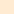
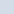

# Designsystem & Token-Leitfaden

Dieser Leitfaden bündelt die aktualisierten Design Tokens, Typografie- und Spacing-Regeln sowie die wichtigsten Komponentenrichtlinien des Redesigns. Ergänzende Analysen bleiben in `docs/entwurf-und-analyse.md` dokumentiert.

## Technischer Überblick

- **UI-Stack:** Tailwind CSS + shadcn/ui (Buttons, Dialoge, Tabs, Tabellen, Form Controls)
- **Formulare:** react-hook-form + zod
- **Icons:** lucide-react
- **Realtime:** Socket.io Hooks (`@/hooks/useRealtime`)
- **Design-Tokens:** `src/design-system/tokens.json` ist die Single Source of Truth. Nach Anpassungen immer `pnpm design-system:tokens` ausführen – dadurch wird `src/app/design-tokens.css` neu erzeugt und die CSS-Custom-Properties aktualisiert.

## Farbpalette

Die Farbwerte liegen in OKLCH und sind für helle wie dunkle Modi gepflegt. Die Hex-Werte dienen zur schnellen visuellen Referenz (Swatches unter `docs/swatches`).

| Rolle | Token | Vorschau |
| --- | --- | --- |
| Primär-CTA, Fokus | `--primary` / `--primary-foreground` |  |
| Primär-Tint | `primary` Soft (`Badge`, Sekundäraktionen) |  |
| Sekundär-CTA | `--secondary` / `--secondary-foreground` |  |
| Sekundär-Tint | `secondary` Soft-Flächen, Highlights |  |
| Akzent/Interaktion | `--accent` / `--accent-foreground` |  |
| Akzent-Tint | `accent` Soft States, Pills |  |
| Erfolg | `--success` / `--success-foreground` |  |
| Warnung | `--warning` / `--warning-foreground` |  |
| Info | `--info` / `--info-foreground` |  |
| Destruktiv | `--destructive` / `--destructive-foreground` |  |
| Hintergrund dunkel | `--background` (Dark) |  |
| Sekundärflächen dunkel | `--muted` (Dark) |  |
| Hintergrund hell | `--background` (Light) |  |
| Rahmen/Flächen hell | `--border` & `--muted` (Light) |  |

> **Kontrastprüfung:** Alle Primärfarben erfüllen ≥ 4.5:1 auf ihren Gegenstücken. Die `ring`- und `focus-visible`-Farben greifen auf `--primary` zurück.

## Typografie-Hierarchie

Die Typografie wird über Utility-Klassen (`.text-*`) und neue UI-Komponenten gesteuert. Die Basisschrift ist `var(--font-sans)`; Headings nutzen `var(--font-heading)`.

| Ebene | Utility | Verwendung | Beispiel |
| --- | --- | --- | --- |
| Display | `.text-display` | Hero Headline | `<Heading level="display">` |
| H1 | `.text-h1` | Seitentitel | `<Heading level="h1">` |
| H2 | `.text-h2` | Abschnittstitel | `<Heading level="h2">` |
| H3 | `.text-h3` | Untertitel, Feature Cards | `<Heading level="h3">` |
| H4 | `.text-h4` | Kleinere Überschriften | `<Heading level="h4">` |
| Lead | `.text-lead` | Hero-Text, Einleitungen | `<Text variant="lead">` |
| Body L | `.text-body-lg` | Größerer Fließtext | `<Text variant="bodyLg">` |
| Body | `.text-body` | Standard-Fließtext | `<Text variant="body">` |
| Body S | `.text-body-sm` | Meta-Angaben | `<Text variant="small">` |
| Caption | `.text-caption` | Labels, Legenden | `<Text variant="caption">` |
| Eyebrow | `.text-eyebrow` | Kicker, Kategorie | `<Text variant="eyebrow">` |

**Komponenten:**
- `Heading` (in `@/components/ui/typography`) kapselt Level, Tonalität (`tone`) und Ausrichtung.
- `Text` deckt Body-, Lead- und Caption-Typen ab und erlaubt `tone`, `align`, `weight` sowie das Rendern via `asChild`.

## Spacing & Grid Tokens

Die Layout-Variablen folgen einem 8pt-System, ergänzt um halbe Schritte:

- `--space-3xs`: 0.25rem (4px)
- `--space-2xs`: 0.5rem (8px)
- `--space-xs`: 0.75rem (12px)
- `--space-sm`: 1rem (16px)
- `--space-md`: 1.5rem (24px)
- `--space-lg`: 2rem (32px)
- `--space-xl`: 3rem (48px)
- `--space-2xl`: 4rem (64px)
- `--space-3xl`: 6rem (96px)

Weitere Layout-Konstanten:
- `--layout-max-width`: 90rem (1440px Bühne)
- `--layout-gutter`: responsive Außenabstände (mobile 1rem → Desktop 3–4rem)
- `--header-height`: 4rem (mobile) / 5rem (≥768px)

## Komponentenrichtlinien

### Buttons (`@/components/ui/button`)
- **Varianten:** `primary` (alias `default`), `secondary`, `accent`, `outline`, `ghost`, `subtle`, `link`, `destructive`, `success`, `info`.
- **States:** Hover reduziert Deckkraft bzw. hebt Konturen hervor; `focus-visible` nutzt `ring` + Offset, `disabled` setzt `opacity-60` und deaktiviert Pointer Events.
- **Sizes:** `xs`–`xl` plus `icon`, alle auf das 8pt-Raster abgestimmt.

### TextLink (`@/components/ui/text-link`)
- Variants: `default` (primär), `subtle`, `muted`, `ghost`, `accent`, `button`.
- Unterstützt `weight` (`medium`/`semibold`), `asChild` (Integration mit `next/link`) und `disabled` (setzt `aria-disabled`, entfernt Tab-Fokus).
- Fokusring via `ring`-Token, Underline-Offset standardisiert.

### Badges (`@/components/ui/badge`)
- Neue tönungsbasierte Varianten (`default`, `secondary`, `accent`, `muted`, `success`, `warning`, `info`, `destructive`, `outline`, `ghost`) + Größen `sm`, `md`, `lg`.
- Standardmäßig pill-förmig (`rounded-full`) mit getönten Hintergründen; Outline-Variante erzeugt Hover-Hervorhebung.
- SVG-Icons skalieren automatisch (`[&>svg]:size-3`).

## Utility-Übersicht

Die neuen Utilities werden in `src/app/globals.css` gepflegt und können auch direkt in Tailwind-Klassen genutzt werden:

- `.text-display`, `.text-h1` … `.text-eyebrow`
- `.text-body`, `.text-body-lg`, `.text-body-sm`, `.text-caption`
- `--font-body`, `--font-heading`, `--font-display` für zukünftige Schriftwechsel

## Pflege & Workflow

1. Tokens bearbeiten (`src/design-system/tokens.json`), anschließend `pnpm design-system:tokens` ausführen.
2. Farbänderungen in `docs/swatches/palette.sample.json` pflegen und per `pnpm swatches:gen` aktualisieren.
3. Typografie/Spacing-Anpassungen in `src/app/globals.css` dokumentieren und in diesem Leitfaden vermerken.
4. Für UI-Komponenten Beispiele in Storybook/Playground ergänzen (falls vorhanden) und die Varianten in Commit-Messages erwähnen.
